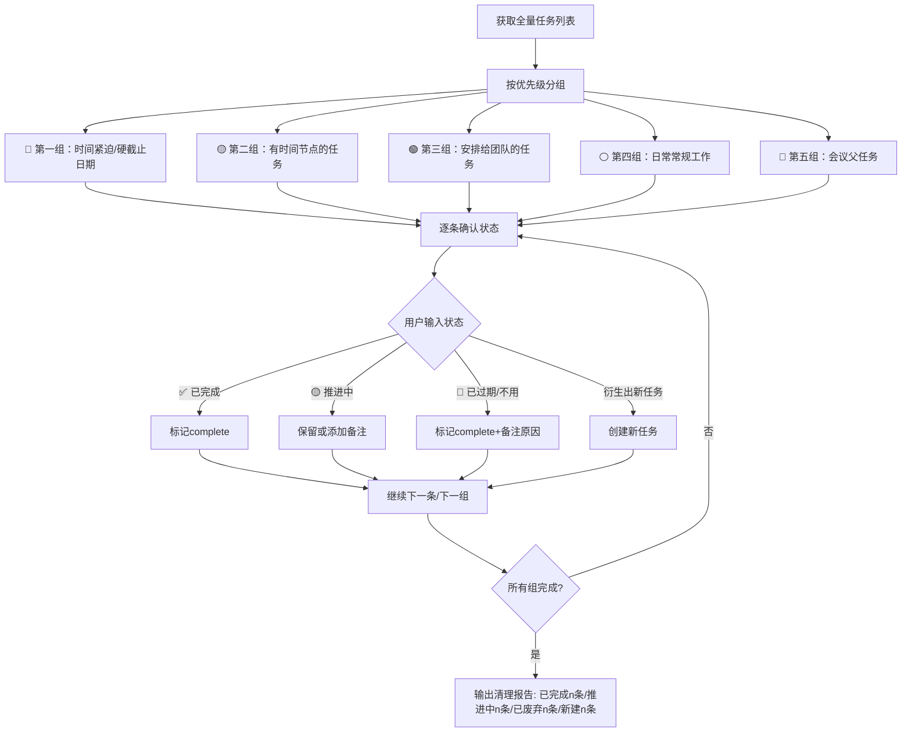

# C012 飞书待办事项管理系统

## 🚚 迁移公告（v5.0 — 2026-05-20 → v6.1 — 2026-05-21 实际执行）

**当前状态：21条C012飞书待办任务已全部迁移至滴答清单（2026-05-21）。3个项目已创建。V2标签通过ticktick-sdk创建时遇到access_forbidden，工作区已记录：V1 API创建任务时tags字段可用（不依赖V2标签注册）。**

| 事项 | 说明 |
|:-----|:-----|
| **原因** | 飞书Task API限制（list不返回应用任务、成员不可追加），任务零碎，推荐不准 |

### ✅ 已执行部分（2026-05-21）

| 项目 | 状态 | 说明 |
|:-----|:----:|:-----|
| OAuth2 授权 | ✅ | `TICKTICK_ACCESS_TOKEN=ff5254...7845` 有效期至2026-11-17 |
| 桥接脚本 | ✅ | `ticktick-bridge.py` — V1 API 封装，支持 projects/today/create/batch/complete/delete |
| ticktick-sdk | ✅ | v0.4.3 安装于 hermes venv |
| 项目创建 | ✅ | 创建3个核心项目：⚡EAST治理 / 📬委派跟进 / 📋会议待办 |
| 晨间全景脚本 | ✅ | `morning-panorama-ticktick.py` — 从滴答取数，精简输出 |
| 方案HTML | ✅ | 上传飞书：`UKGnbDnMrobghrxz7sgcKnbnnKc` |

### ✅ 已执行（2026-05-21 实际完成）\n\n| 事项 | 状态 | 说明 |\n|:-----|:----:|:-----|\n| 项目创建 | ✅ | ⚡EAST治理(6a0e5b5ee4b0e87193184017) / 📬委派跟进(6a0e5b5ee4b0e19c53ff35d4) / 📋会议待办(6a0e5b5ee4b04e66f3f843fe) |\n| 任务迁移 | ✅ | 21条C012活跃任务一次性POST创建到对应项目，含tags字段和priority |\n| 晨间全景改投 | ✅ | cron(8114210bdc6c)改为no_agent模式，工作日09:00投递🗓️办公室群 |\n| V2标签 | ⏳ | `access_forbidden`，但V1 API创建任务时tags字段可用（见下面工作区） |

### ⚠️ 双API认证陷阱\n| **新系统** | 滴答清单（dida365.com），OAuth2 API，完整CRUD，原生分类/优先级/标签/日历 |\n| **迁移方式** | Get笔记会议转录 → 我去重归类 → ticktick-sdk (Python) → 滴答清单 |\n| **并行期** | Day 1-3: 新任务写入滴答清单，飞书待办只读 |\n| **完成期** | Day 7+: 彻底关闭C012，所有任务在滴答清单中管理 |\n| **⚠️ 双API认证** | ticktick-sdk 需要同时配置 V1(OAuth2) + V2(会话) 两组凭证 |\n| **方案文档** | 飞书项目/→ `迁移方案_飞书待办到滴答清单_v1_FINAL_20260520.html` |\n\n> ⚠️ **迁移完成前**：继续使用飞书待办创建任务。迁移开始后，所有新任务默认写入滴答清单。\n> 迁移后晨间简报09:00改为从滴答清单拉取今日待办。\n\n### 📦 滴答清单接入步骤（2026-05-21 实测验证）\n\n#### 0. 前置条件\n- 用户有滴答清单账号（dida365.com），非 ticktick.com\n- 开发者在 https://developer.dida365.com/manage 创建应用，获取 Client ID + Client Secret\n\n#### 1. 安装 ticktick-sdk\n安装在 Hermes venv 中：\n```bash\n/hermes/venv/bin/pip install ticktick-sdk\n```\n\n#### 2. 配置 Redirect URI\n在开发者应用中，将 Redirect URI 设为 `http://127.0.0.1:8080/callback`。\n不配则返回 `error="invalid_request", error_description="At least one redirect_uri must be registered"`\n\n#### 3. OAuth2 授权（获取 V1 access_token）\n```bash\nexport TICKTICK_CLIENT_ID='xxx'\nexport TICKTICK_CLIENT_SECRET='xxx'\nexport TICKTICK_HOST='dida365.com'   # ⚠️ 必须设，否则跳转到 ticktick.com\n/hermes/venv/bin/ticktick-sdk auth --manual\n```\n输出授权 URL → 用户打开 → 登录授权 → 跳转到 `localhost:8080/callback?code=xxx` → 粘贴 code → 获 access_token（有效期 4320h/180天）。\n\n#### 4. ⚠️ 双API认证陷阱\nticktick-sdk 需双API：\n| API | 类型 | 所需凭证 |\n|:----|:-----|:---------|\n| V1 (OAuth2) | 官方 | Client ID + Secret + access_token |\n| V2 (Session) | 非官方解析 | 滴答清单邮箱 + 密码 |\n\n`client.connect()` 同时校验两者，V2 缺失报 `TickTickConfigurationError: Both V1 and V2 APIs are required`。\n\n#### 5. Python SDK 调用示例\n```python\nclient = TickTickClient(client_id='', client_secret='',\n    v1_access_token='', username='', password='')\nawait client.connect()\nprojects = await client.get_all_projects()\ntoday = await client.get_today_tasks()\ntask = await client.create_task({'title':'...', 'projectId':'inbox'})\n```\n\n#### 6. V2标签创建（受限）及工作区\nV2 API 登录返回 `access_forbidden`（可能因密码编码或账户策略），但 **V1 API 创建任务时 tags 字段可用**——标签名作为字符串随任务一起写入。此方法不注册标签到滴答标签管理器，但依然可在任务详情中显示和过滤。\n\n创建任务时带标签：\n```python\n{\"title\": \"任务\", \"projectId\": \"xxx\", \"priority\": 1, \"tags\": [\"委·照宇\"]}\n```\n\n**代价**：标签未在滴答全局注册 → 滴答App的标签管理器/侧边栏看不到标签。用户需在Web端手动创建同名标签才能完全注册。\n\n环境变量：`references/ticktick-migration-setup-20260521.md` 含完整实测记录。\n---\n\n# C012 飞书待办事项管理系统\n\n## 🚚 迁移公告（v5.1 — 2026-05-21）\n\n**当前状态：正在迁出飞书待办，目标系统为滴答清单(dida365.com)。**\n\n| 事项 | 说明 |\n|:-----|:-----|\n| **原因** | 飞书Task API限制、任务零碎、推荐不准 |\n| **新系统** | 滴答清单 — OAuth2 API，原生分类/优先级/标签/日历/看板 |\n| **管线** | C013 Get笔记 → 我去重+归类+优先级 → ticktick-sdk → 滴答清单 |\n| **阶段** | Day 1-3并行期 → Day 4-7验证期 → Day 7+彻底关闭 |\n| **⚠️ 双API认证** | ticktick-sdk 需同时配置 V1(OAuth2 token) + V2(用户名+密码) |\n| **开发者后台** | https://developer.dida365.com/manage（dida365 非 ticktick.com） |\n| **接入步骤** | 见上方「滴答清单接入步骤」及 `references/ticktick-migration-setup-20260521.md` |

### ⚠️ 使用时的关键区分（v6.0 新增）

**🔴 开发执行策略（非本技能范围）：**
- P0/P1/P2 优先级排序 → 属于 C005 编码开发工作流
- 切片式推进（沿关键路径打通最小闭环）→ 属于开发方法论
- 上述策略不要混入 C012 任务管理中

**✅ 任务管理策略（本技能范围）：**
- 时段-精力匹配（上午高峰做决策/下午平稳做执行）
- 项目立项门禁（5条标准判断什么事才建项目）
- 委派标签体系（按部门职责打标→自动路由+跟进）
- 突发事件缓冲槽（待归位列→不破坏当日节奏）
- 通勤标签库（低能时段自动推任务清单）

> 完整策略方案参考: `references/ticktick-task-energy-strategy-v2.html`
> 委派标签映射关系: `委·照宇`→EAST/客户数据/数据中台, `委·庄经纬`→知识管理, `委·张子越`→外部数据管理/资产管理, `委·曹爽`→数据安全, `委·科创中心`→技术开发

### 🎯 项目立项门禁（v6.1 新增）

不是所有工作都需要建一个滴答项目。只有满足以下条件才应升级为项目进行管理。

| # | 标准 | 说明 | ✅ 示例 | ❌ 反例 |
|:-:|:----|:-----|:-------|:--------|
| 1 | 有明确目标+结束状态 | 项目结束时能清晰判断"做完了" | EAST数据治理项目 | "持续改进"不是项目 |
| 2 | 跨3+个子任务 | 无法用一条待办完成 | 阵地回复终审(起草→会签→终审) | 单一审批签字 |
| 3 | 涉及多人/多部门 | 需协调外部资源或跨岗位协作 | EAST数据质量检查 | 自己填周报 |
| 4 | 有明确时间线 | 有截止日期或阶段里程碑 | 保信交流会准备(5/21) | "有空再做"归类为任务 |
| 5 | 跨日常工作流 | 无法纳入固定标签体系 | 年报筹备、监管专项检查 | 每日邮件分类(C013) |

**生命周期**: Active → Paused(等待外部) → Done(归档到已结项文件夹) → Cancelled(保留1月后删除)

### 🏷️ 委派标签体系（v6.1 新增）

按部门职责归属定义委派标签。标记后自动路由责任人+跟进节奏。

| 标签 | 责任人 | 负责领域 | 跟进节奏 |
|:----|:------|:--------|:--------|
| `委·照宇` | 张照宇 | EAST数据治理/客户数据管理/数据中台建设 | 每周一进度确认 |
| `委·庄经纬` | 庄经纬 | 知识管理(AI项目/太爱问/垂类模型) | 每两周进展核对 |
| `委·张子越` | 张子越 | 外部数据管理/资产管理 | 每周一进度确认 |
| `委·曹爽` | 曹爽 | 数据安全(DLP/敏感数据/信息安全承诺书) | 按事件响应 |
| `委·科创中心` | 科创中心 | 技术开发/系统修复/保信工具 | 每两周排期确认 |

**⚠️ 当前约束**：标签需要通过 V2 API 创建，需用户提供滴答清单登录密码。V1 OAuth2 无法创建标签。

### ⚠️ 滴答 V1 API 关键限制（2026-05-21 实测）

#### V1 API 只写不读

| 端点 | 状态 | 说明 |
|:----|:----:|:------|
| `GET /project` | ✅ | 列出项目 |
| `POST /task` | ✅ | 创建任务（返回完整数据） |
| `POST /task/{pid}/{tid}/complete` | ✅ | 完成任务 |
| `POST /batch/task` | ✅ | 批量创建 |
| `GET /task` | ❌ 500 | **不能读取任务列表** |
| `GET /project/{id}/task` | ❌ 404 | **不能按项目读取任务** |
| `GET /task/{id}` | ❌ 500 | **不能读单条任务** |

**结论**：滴答 V1 API 设计为**只写不读**—只能创建/完成/删除，无法查询已有任务。

#### V2 API 同样受限

- 端点 `POST /api/v2/user/signon` 返回 HTTP 500 `access_forbidden`
- ticktick-sdk 的 V2 会话认证（`TickTickClient(username, password)`）也失败
- **原因**：Dida365 中国版 V2 API 有 session 重放保护（session 绑定浏览器指纹/IP/User-Agent），cookies 提取后在浏览器外直接调用全部返回 HTTP 401 `user_not_sign_on`
- **但浏览器正常登录后可用**：Web 应用通过正常浏览器登录流程可获得完整 V2 会话（IndexedDB 中存储全量任务数据）

#### 解决方案：本地注册表 + 浏览器同步双轨制

```
┌──────────────────────┐     ┌─────────────────────────┐
│ ① 本地注册表（主力）    │     │ ② 浏览器同步（辅助）       │
├──────────────────────┤     ├─────────────────────────┤
│ 创建/完成通过 V1 POST  │     │ 登录 dida365.com 后       │
│ → 同步写入注册表        │     │ 浏览器 IndexedDB 提取任务  │
│ 全景脚本→读注册表       │     │ → 更新注册表              │
│ cron 运行无需浏览器     │     │ 手动触发（ticktick-sync）  │
└──────────────────────┘     └─────────────────────────┘
```

**核心脚本**：
| 脚本 | 路径 | 功能 |
|:----|:-----|:-----|
| `morning-panorama-ticktick.py` | `~/.hermes/scripts/` | 三区展示（🔴亲自/🟡委派/📊统计） |
| `ticktick-sync.py` | `~/.hermes/scripts/` | 从浏览器 IndexedDB 同步真实数据 |
| `ticktick-bridge.py` | `~/.hermes/scripts/` | V1 API 桥接 + 注册表维护 |
| `ticktick-registry.json` | `~/.hermes/data/` | 本地任务注册表 |

**IndexedDB 提取命令**（需在已登录 dida365.com 的浏览器控制台执行）：
运行 `python3 ~/.hermes/scripts/ticktick-sync.py --cmd` 输出完整 JS 命令。

#### 本地注册表结构

`~/.hermes/data/ticktick-registry.json`：
```json
{
  "version": "2.0",
  "last_synced": "2026-05-21",
  "tasks": [{
    "id": "task-001",
    "title": "阵地回复终审",
    "project": "⚡EAST治理",
    "priority": 3,
    "status": "pending",
    "state": "亲自|委派中",
    "delegate_tag": "",
    "deadline": "",
    "last_tracked": "",
    "result_summary": "",
    "overdue": false
  }]
}
```

---

### 🎯 亲自vs委派 精准判断规则（v6.2 新增 — 2026-05-21）

**核心理念**：不是所有你的任务都需要你做。精准区分「什么必须亲自做」「什么应该委派」，是任务管理的核心能力。

#### 🔴 亲自处理判断规则（仅以下4类需你亲自）

| # | 判断维度 | 包含 ✅ | 不包含 ❌ | 典型场景 |
|:-:|:--------|:--------|:---------|:---------|
| 1 | **制定方案** | 策略方向确定、制度框架设计、方案核心决策 | 方案初稿起草/素材收集（→委派，你终审） | EAST考核指标框架设计 |
| 2 | **准备汇报** | 向苏总/翟总/外部领导的汇报材料**终审定稿** | 素材收集/初稿/数据填充（→委派） | 季度会汇报框架定稿 |
| 3 | **组织协调（跨多部门）** | 需你出面拍板的关键节点、跨部门利益协调会 | 常规催办/信息传递/流程跟进（→委派） | 阵地回复三部门联合终审 |
| 4 | **终审/签字** | 对外口径审定、制度最终签批、回复终审定稿 | 初稿/中间版本（→委派） | 对外回复稿终签 |

**限流规则**：🔴亲自项同时不超过3项。超出部分要么委派出去，要么标记为「待定」放入📥收件箱缓冲。

#### 🟡 委派处理判断规则（6类具体实操层）

| # | 类型 | 关键词 | 委派对象 | 示例 |
|:-:|:----|:-------|:--------|:-----|
| 1 | **数据核对/统计类** | 核实、核对、排查、汇总 | 照宇/倩茹 | 联共表核实、共保单核对 |
| 2 | **催办跟进类** | 催、跟进、确认进度 | 照宇/科创中心 | 催谢立项回复、催保信流程 |
| 3 | **材料填充/收集类** | 填充、收集、梳理 | 照宇/张子越 | 季度会待填充、考核指标收集 |
| 4 | **信息问询类** | 问、了解、确认情况 | 庄经纬/各负责人 | 问庄老师聚类进展 |
| 5 | **流程跟进类** | 催、推进、到位情况 | 科创中心/曹爽 | 催到位情况、催碰会 |
| 6 | **邮件/公函发出类** | 发邮件、通知、回复 | 对外联络部 | 催窦如军邮件、通知参会 |

#### 🔁 委派三阶段闭环机制

每一项委派任务都要经历完整的「发出→督办→回收」生命周期：

```
┌─────────────────────────────────────────────────────────────────────┐
│                    委派任务生命周期闭环                               │
├───────┬────────────────────┬────────────────────────────────────────┤
│ 阶段   │ 操作               │ 用户需要知道什么                        │
├───────┼────────────────────┼────────────────────────────────────────┤
│ ①发出  │ 创建到📬委派跟进     │ 谁做、做什么、截止到哪天                │
│        │ 打标签（委·照宇等）  │                                       │
│        │ 设截止日期          │                                       │
├───────┼────────────────────┼────────────────────────────────────────┤
│ ②督办  │ 截止日前1天自动提醒  │ 还差什么没完成（但要简略）              │
│        │ 逾期即时升级        │ 逾期原因（被卡在哪里）                  │
│        │ 晨间全景展示状态     │ 各委派项当前是🟡/⚠️/✅                 │
├───────┼────────────────────┼────────────────────────────────────────┤
│ ③回收  │ 委派人回复结果      │ 发生了什么（摘要）                     │
│        │ 你确认了解          │ 结果如何                              │
│        │ 标记✅已回收        │ 是否需要你决策→🔄升为🔴               │
│        │ 或🔄需决策→升🔴     │ 不需要→归档                           │
└───────┴────────────────────┴────────────────────────────────────────┘
```

#### 🏷️ 委派状态标签体系

在滴答清单中，每条委派任务除责任人标签外，附加状态标签：

| 标签 | 含义 | 呈现 | 触发条件 |
|:----|:-----|:-----|:---------|
| `状态·委派中` | 🟡正常推进 | 晨间全景🟡显示 | 委派发出，未逾期 |
| `状态·逾期` | ⚠️ 已超截止日 | 晨间全景⚠️显示，逾期升级 | 超过截止日未完成 |
| `状态·已回收` | ✅ 已收到结果 | 晨间全景✅区显示 | 你确认了解了结果 |
| `状态·待决策` | 🔄 结果需你拍板 | 升为🔴亲自处理 | 委派结果需要你的决策 |

#### 📊 晨间全景三区展示（改造后格式）

```
☀️ 晨间全景 · 05/21 周四

━━━ 🔴 亲自处理（2项）━━━
  🔴 阵地回复终审（今日）
  🔴 季度会框架定稿（截止5/25）

━━━ 🟡 委派进度（6项）━━━
  🟡 [委·照宇] 季度会待填充    ⏳截止5/25  上次督办5/20
  ⚠️ [委·庄经纬] 聚类进展     逾期2天     需升级催办
  🟡 [委·科创] 保信流程        ⏳截止5/30

━━━ ✅ 本周已回收（3项）━━━
  ✅ [委·科创] 保信流程设计 → 结论:路径A可行，待你确认
  ✅ [委·曹爽] 审计分析碰会 → 已收到会议纪要
```

**展示规则**：
- 🔴区：仅展示亲自项，不展示委派项中的内容
- 🟡区：每项展示责任人、截止日、距上次督办天数，逾期项加⚠️
- ✅区：展示回收结论摘要（发生了什么 + 结果如何）
- 无内容区自动隐藏，不展示空区域

#### 与旧规则的关系

新规则不推翻旧的四层介入层级判断逻辑，而是在其基础上**精准化**：
- 旧：「🔴亲自处理 = 不做没人能拍板的」
- 新：「🔴亲自处理 = 制定方案/准备汇报/组织协调/终审签字 之一」
- 旧：「🟡深入了解可委托 = 委托执行但必须听结论」
- 新：「🟡委派 = 6类具体实操层之一 + 三阶段闭环跟踪」

两套可并行——旧是「判断你是不是该关注」，新是「判断你应该委派还是自己做」。

#### ⚙️ 自动分类关键词表（全景脚本用）

晨间全景脚本通过关键词自动判定任务的亲自/委派归属，每次创建新任务时需应用此表：

| 判定结果 | 标题包含关键词 | 优先级 |
|:--------|:--------------|:------|
| 🔴 亲自 | 方案、汇报、组织、协调、终审、签字、定稿、框架 | 高（保留亲自） |
| 🟡 委派 | 核对、核实、排查、汇总、发、催、填充、确认、反馈、修稿、问、了解、推进、起草、碰会 | 低（委派） |

**执行逻辑**：标题同时包含 🔴 和 🟡 关键词时，🔴 关键词优先（因为"终审核对"="终审"判定为亲自）。此规则已在 `morning-panorama-ticktick.py` 中实现为 `DELEGATE_KEYWORDS` 列表。

当用户提及"任务体系"、"系统架构"、"任务全景"、"整个系统"、"task system"等宽泛表述时，**必须先确认范围**，不可默认用户要的是全局视图。

| 用户说 | 大概率对应 | 而非 |
|:-------|:----------|:-----|
| "任务体系/系统架构" | **C012 个人任务管理体系**（三层模型+Cron编排+注册表） | 整个能力注册表（C000-C014） |
| "整个系统/全景" | 需澄清——是全能力注册表还是当前C012架构 | 自动推断 |

**确认句式模板：**
> 你是想了解「个人任务管理体系（C012 飞书待办）」的架构，还是看整个系统能力全景（C000-C014 全部注册能力）？

仅当用户已答过此问题（本会话中已确认过范围），可直接延续已有范围。跨会话不记忆范围。

---

## 概述

基于飞书 Task v2 API + 本地注册表双轨存储的待办管理系统。由于 Feishu API 的 list 接口无法返回应用创建的任务，本地注册表（`~/.hermes/data/task-registry.json`）作为任务索引，Feishu 任务作为真实存储。

## 体系定位（v3.0 三层分离模型）

C012 不再试图同时承载「战略全景」和「日常行动」两个职责。2026-05-15 重塑后，任务管理分为三个独立层次：

| 层次 | 载体 | 内容 | 更新频率 |
|:----|:-----|:-----|:---------|
| 🌲 **全景仪表盘** | 飞书文档 | 所有专项的🔴🟡🟢状态 | 每周更新 |
| 🌳 **C012 行动清单** | 飞书Task | 仅🔴+🟡需要你动手/决策的任务 | 日常使用 |
| 🌟 **日工作建议** | cron 08:00推送 | Top3 + 节奏安排 + 执行建议 | 每日 |

**核心原则**：🟢（定期了解）不进 C012 行动清单——只看仪表盘。

## 任务分类体系（v3.0 两维度系统）

2026-05-15 重塑：废弃原本的 6 大工作性质分类（🔍📄🤝🛠📋👥），替换为两维度正交系统：

### 维度一：注意力深度（你的角色）

| 层级 | 含义 | 行为模式 |
|:----|:-----|:--------|
| 🔴 **亲自处理** | 必须由你亲自产出或审定 | 全程关注，不可委托 |
| 🟡 **深入了解可委托** | 委托执行，但你必须听结论 | 知道「发生了什么、怎么判断的」 |
| 🟢 **定期了解** | 按节奏关心进度 | 不出异常不打扰，不限时出现在 C012 中 |
| ⚪ **不该过问** | 从你的视野中移除 | 不进入任何层次 |

### 维度二：执行模式（怎么做事）

| 模式 | 含义 | 处理方式 | 代表任务 |
|:----|:-----|:--------|:--------|
  | 📝 **文书** | 写/改/审材料 | 需专注时段，至少30分钟 | `🔴 📝 写季度会初稿` |
| 📞 **沟通** | 打电话/催进度/协调 | 集中处理，5-10分钟一条 | `🟡 📞 催中银保信流程` |
| 📅 **会议** | 准备/参加/跟进 | 日历对齐 | `🔴 📅 保信交流会` |
| ⚡ **执行** | 系统操作/审批/碎片动作 | 碎片时间处理 | `🟡 ⚡ 催中台权限` |

### 命名格式（v4.0 — 2026-05-18 启用）

**核心精简**：移除 `[项目前缀]` 和 `💼` 前缀，标题仅保留执行描述（≤10字）。

**格式**：`🔴/🟡 📝/📞/📅/⚡ 行动描述(≤10字)`

| 字段 | 位置 | 说明 | 示例 |
|:-----|:-----|:-----|:-----|
| 优先级 | summary 首字符 | 🔴亲自/🟡可委托 | `🔴 📞 催审计清单` |
| 执行模式 | summary 第二段 | 📝文书/📞沟通/📅会议/⚡执行 | `🟡 📝 考核方案起草` |
| 行动描述 | summary 尾部 | ≤10字，精炼表达核心动作 | `🔴 📅 保信交流会` |
| 项目名 | description 首行 `【项目】` | 专项名称 | `【项目】EAST` |
| 来源 | description `【来源】`行 | 来源会议/工作安排+时间 | `【来源】5/18会议` |
| 背景 | description `【背景】`行 | 为何做、注意事项 | `【背景】5/28季度会材料` |

示例完整：
- summary: `🔴 📝 季度会修稿`
- description: `【项目】EAST\n【来源】5/18 季度会材料讨论\n【背景】5/28季度会汇报，需在5/21前完成初稿`

**解析逻辑**（`daily-task-review.py`）：
1. 从 `task.project` 或 description `【项目】` 行提取项目名
2. 从 summary 提取优先级emoji (🔴🟡🟢) 和执行模式emoji (📝📞📅⚡)
3. 剩余部分为行动描述（≤10字）

**设计理由**：之前 summary 中的 `[项目名]` 消耗了标题空间（约6-8字符），且与 project 字段/description 中的项目信息重复，精简后可留更多空间给核心行动描述。项目信息通过 `task.project` 字段和 `description` 的 `【项目】` 行结构化存储，查询和排序更可靠。

### 项目简称表

| 简称 | 对应专项 |
|:----|:--------|
| EAST | EAST数据治理、季度会、数据修正 |
| 回复 | 一流阵地回复 |
| 团队 | 扩增、分工调整 |
| 科创 | 中银保信、科创对接 |
| AI | 知识管理、聚类分析、垂类模型 |
| 系统 | DLP、安全、权限、合规 |
| 考核 | 考核修订 |
| 项目 | 项目进度汇报 |
| 五报 | 五报四整改 |
| 产险 | 产险数据相关 |


---

### 设计警示：正交维度 vs 冗余维度（2026-05-15 用户纠正记录）

在从 v2.x 到 v3.0 的首次方案中，我犯了一个典型错误：**把「注意力深度（🔴🟡🟢）」维度完全丢掉，替换为仅有「执行模式（📝📞📅⚡）」**。用户指出这两个维度是正交的——一个回答「这条任务我该投入多少关注」，另一个回答「这条任务怎么干」。去掉前者是矫枉过正。

**简化系统的正确方法**：先识别哪些维度是**正交的（需保留）**，哪些是**冗余的（可合并）**。

| 维度 | 正交性 | 结论 |
|:-----|:-------|:-----|
| 注意力深度 (🔴🟡🟢) | 回答「你的角色」 | ✅ 保留——与执行模式正交 |
| 执行模式 (📝📞📅⚡) | 回答「怎么做事」 | ✅ 保留——与注意力深度正交 |
| 6大工作分类 (🔍📄🤝) | 与执行模式高度重叠 | ❌ 废弃——4种模式已覆盖 |
| 会议名前缀 (📋[会议]) | 与项目简称重叠 | ❌ 废弃——项目简称更简洁 |

**判断方法**：如果两个维度可以用「...且...」来描述（如「这个任务我需要亲自处理**且**通过沟通完成」），就是正交的，都应保留。如果一个维度可被另一个的组合覆盖，就是冗余的。

### 向后兼容声明

v2.x 的以下能力保留但不主动推广（作为辅助分析工具）：

| 能力 | 保留价值 | 何时使用 |
|:-----|:---------|:---------|
| 6大工作分类（🔍📄🤝🛠📋👥） | 分析新任务性质，辅助判断执行模式 | 会议待办初次归类时 |
| 4层介入层级判断逻辑 | 决定任务所属层级（🔴🟡🟢⚪） | 创建新任务时辅助决策 |
| 父子结构 API | 串行依赖 ≥3 子任务时 | 特定场景保留 |
| 清理审计工作流 | 完全保留 | 按需触发 |

## 🎯 v3.0 三层任务管理体系（2026-05-15 启用）

> v2.x 的 6 大分类 + 4 层介入层级 + 父子结构在飞书 Task 中过于复杂，v3.0 将其拆解为三个独立的层次，各司其职：
>
> - **🌲 森林** — 项目全景，周级更新，用飞书文档承载
> - **🌳 树木** — 动作清单，每天打开看「我接下来做什么」
> - **🌟 日建议** — 执行策略，告诉你「优先做什么 + 怎么做」

### 三层的分工与节奏

```
        层次                        更新频率                    用户的角色
┌──────────────────────────────────────────────────────────────────────────┐
│                                                                           │
│  🌲 森林：项目全景仪表盘           每周 1-2 次              看整体不焦虑     │
│     飞书文档，6-8 个专项推进状态                                           │
│                                                                           │
│  🌳 树木：C012 动作清单           每天打开                  我该做什么      │
│     精简命名：[项目] 📝/📞/📅/⚡ 行动                                    │
│                                                                           │
│  🌟 日工作建议                    工作日 08:00 cron 推送     我该怎么做      │
│     策略：Top 3 优先 + 时间安排 + 执行方式                                │
│                                                                           │
└──────────────────────────────────────────────────────────────────────────┘
```

### 三层之间的协同

- 每天你打开飞书看见的是 🌳 动作清单（C012），告诉你「今天做什么」
- 每天 08:00 🌟 日建议告诉你「先做哪个、怎么做、什么时间做」
- 每周你看 1-2 次 🌲 仪表盘，了解各个专项的整体推进，不焦虑
- **三件事不混在一起**——你在 C012 里不需要消化项目全景，看仪表盘就行

---

### 🌳 任务命名规范（v3.0 核心）

**新格式**：`[项目简称] 📝/📞/📅/⚡ 行动描述`

| 项目简称 | 对应专项 | 示例 |
|:--------|:--------|:-----|
| EAST | EAST数据治理、季度会、数据修正 | `📝 写季度会初稿` |
| 回复 | 一流阵地回复 | `📝 终审定稿` |
| 团队 | 扩增、抽调、分工 | `📞 催泰科到位` |
| 科创 | 中银保信、科创对接 | `📞 催中银保信流程` |
| AI | 知识管理、聚类、垂类模型 | `⚡ 跟聚类结果` |
| 系统 | DLP、安全、权限申请 | `📞 催DLP方案` |
| 产险 | 产险数据修正/异常清理 | `⚡ 异常单匹配` |
| 五报 | 五报四整改 | `📝 写整改汇报` |
| 考核 | 考核修订 | `📝 方案起草` |
| 项目 | 项目进度/苏总汇报 | `📝 进度汇报` |

**新增任务时严格执行此格式**。现有 v2.x 格式的任务逐步迁移。

### 4 种执行模式（取代原来的 6 大分类）

| 模式 | 含义 | 处理方式 | 建议时段 |
|:----|:-----|:--------|:--------|
| 📝 **文书** | 写/改/审材料 | 需专注时段，至少 30 分钟 | 上午 10:00-11:30 |
| 📞 **沟通** | 打电话/催进度/协调 | 集中处理，5-10 分钟/条 | 下午 14:00-14:30 |
| 📅 **会议** | 准备/参加/跟进 | 日历对齐 | 按会议时间 |
| ⚡ **执行** | 系统操作/审批/设置 | 碎片时间 | 穿插在文书之间 |

### 优先级策略（取代原来的 🔴🟡🟢⚪ 层级标签）

不以层级标签为主，而是靠两个天然信号：

1. **截止日期** — 下周三到期的自动排在前面
2. **模式集中处理** — 📝 类需要大块时间，📞 类可以集中打出去

**介入层级的判断逻辑**（来自 v2.5，保留作为辅助判断工具，但不写入任务标题）：
- 🔴 亲自处理 — 不做没人能拍板的
- 🟡 深入了解 — 委托执行但要听结论
- 🟢 定期了解 — 按节奏看进度
- ⚪ 不该过问 — 不写入 C012

### 父子结构保留原则

只有当一组动作满足以下条件时保留父子结构：
- **同一项目 + 同一执行模式**（如多个 📞 沟通动作）
- **子任务 ≥ 3 条**
- **有明确的串行依赖关系**（A→B→C）

不满足任一条件的直接平铺。

---

### 🌲 项目全景仪表盘

#### 位置

飞书云盘「Hermes生成文件夹」下的 Feishu 文档，每周更新 1-2 次。

#### 更新流程

- 每周五下午/周末，用户说「更新仪表盘」或我扫描 C012 状态后自动触发
- 读取当前 C012 活跃任务 + 本周动态 → 刷新仪表盘内容
- 版本号递进（不覆盖旧文档）

#### 结构

参见 `references/three-layer-task-model.md` 中的仪表盘模板。

---

### 🌟 晨间简报（含日工作建议）

> **v4.0 变更**：日工作建议 cron 已于 2026-05-18 合并到晨间简报中。**v4.1 变更**：2026-05-18 作息调整，推送时间从 08:00 改为 **09:00**。**v4.2 变更**：2026-05-20 三 cron 合并为「晨间全景」。**v6.1 变更**：2026-05-21 接入滴答清单后，晨间全景从滴答取数、紧缩格式（仅展示任务概览不细分），投递目标改为 🗓️办公室群（非DM）。用户将在办公室群中看全景，自行在滴答清单中执行/调整。

#### 推送配置

| 属性 | 值 |
|:-----|:---|
| cron ID | `8114210bdc6c` |
| 时间 | `0 9 * * 1-5`（工作日 09:00）|
| 交付 | **🗓️办公室群**（v6.1从DM改为办公室群）|
| 数据源 | **本地注册表** `~/.hermes/data/ticktick-registry.json` |

#### 晨间全景格式（v6.1紧缩版）

仅展示各项目待办概览，高优先级(P0/P1)任务标题可见。用户不在此做任务详情，自行在滴答清单App中管理。

```
☀️ 晨间全景 · 05/21 周四

  ⚡EAST治理  🔴P0×2 · 🟠P1×1
    🔴 催审计清单（截止5/25）
    🔴 保信交流会确认（截止5/21）
    🟠 阵地回复终审

  📋会议待办
    🟠 EAST数据质量检查反馈

  📬委派跟进  🟡P2×3
    🟡 [委·照宇] 数据中台文档
```

输出脚本：`~/.hermes/scripts/morning-panorama-ticktick.py`

无待办时输出 `📭 今日无待办任务`。

#### 撤并纪要

旧格式（含昨日回顾+全天执行建议+计划外登记区）在v6.1不再使用。用户已在滴答清单中管理全部执行细节，晨间全景仅充当"注意力启动器"——告诉你今天有什么就行。

#### 推送配置

| 属性 | 值 |
|:-----|:---|
| cron ID | `8114210bdc6c` |
| 时间 | `0 9 * * 1-5`（工作日 09:00）|
| 交付 | DM 飞书 |
| 触发 | cron 自动推送 + 用户主动问"今天做什么"/"晨间简报" |
| 关联技能 | feishu-task-management-system |

#### 晨间简报模板格式

模板含跟踪复选框（□→☑），支持用户白日自行标记完成情况，计划外事项登记。夜间由 AI 读取更新注册表。

**标准模板结构（v4.2 晨间全景）：**

```
## 📋 晨间全景 · 2026年X月X日 周X

**📌 今日概览：** 待办X项 | 🔴亲自X项 | 🟡可委托X项 | ✅昨日完成X项

### 一、📊 昨日回顾
_（由晚间复盘+待办回顾合并而成）_

**已完成 ✅**
- 完成事项1
- 完成事项2

**待跟进 🟡**
- 跟进中的事项1（当前状态）
- 跟进中的事项2（当前状态）

### 二、📅 今日待办概览
_（🔴/🟡 分层呈现，左侧为每日跟踪复选框）_

**🔴 亲自处理**
| 任务 | 执行模式 | 当前进展 | 今日动作 |
|:----|:--------:|:--------|:--------|
| □ 任务名 | 📝/📞/📅/⚡ | 当前进度 | 今日应做的事 |

**🟡 深入了解可委托**
| 任务 | 负责人 | 当前进展 | 跟踪要点 |
|:----|:------|:--------|:--------|
| □ 任务名 | 某人 | 进展描述 | 需要知道什么 |

### 三、🌟 全天执行建议
1️⃣ **时段建议：** 侧重方向
2️⃣ **执行提示：** 具体建议

### 四、📝 计划外事项登记
_[白日若有临时加进来的任务，请记录在此]_
- 
```

**设计理由：**
- 昨日回顾替代了独立的晚间复盘（18:30）——用户白日勾选跟踪框后，夜间读取更新注册表，次晨汇总呈现
- 🔴/🟡 分层替代了"紧急/普通"的简单二分——保持与C012四层过滤体系一致
- 全天执行建议继承原晨间简报的节奏设计
- 计划外登记区保留原交互模式（□→☑→夜间回写）

**历史模板（v4.1及以前，兼容保留）：**

#### 特殊场景：周一部门例会简报

每周一自动检测"周一例会"信号，需额外生成**例会回顾板块**：

**触发**：周一 09:00 晨间简报自动触发，或用户说"部门例会"/"今天周一例会"

**额外内容**：
1. 查询上周各场会议（从注册表 `project` 字段匹配）的完成/待办状态
2. 提取涉及关键领导（老苏即苏金华总、翟总）交办的任务，单独标注
3. 生成结构化回溯清单：已完成 ✅ / 推进中 🟡 / 待启动 ⏳

**标准开场**：
```
### 📋 今日特别：周一部门例会回顾

**上周重点会议推进状态**

| 会议 | 完成 | 推进中 | 未启动 |
|:----|:---:|:-----:|:-----:|
| 会议1 | N | N | N |
| 会议2 | N | N | N |

**📍 老苏/翟总交办重点**
- [任务1]
- [任务2]

**昨天/上周五的完成情况**
- ...
```

原设计作为独立 cron，现为 08:00 晨间简报的内嵌内容。建议结构如下：

#### 触发方式

| 方式 | 场景 | 实现 |
|:-----|:-----|:-----|
| cron 自动推送 | 工作日 08:00 | 推送到飞书 DM，内容基于 C012 当前状态 |
| 用户主动问 | 「今天做什么」 | 即时拉取 C012 + 仪表盘，生成建议 |

#### 建议生成逻辑

| 输入源 | 优先级策略 |
|:-------|:----------|
| **截止日期** | 未来 3 个工作日内硬节点优先 |
| **依赖关系** | 需要等人回复的先催（给队友留时间） |
| **执行模式** | 📝放上午大块时间，📞放下午集中 |
| **昨日进展** | 从晚间复盘中读取「今天接着哪里做」 |

#### 建议内容结构

```
🌞 5月X日（周X）工作建议

📌 今天 Top 3

  1️⃣ [EAST] 📝 写季度会汇报初稿
     → 为什么：离5/28只有8个工作日
     → 怎么做：先定框架（目标→推进→优化），用监管数据做叙事根基
     → 建议时段：⏰ 上午 10:00-11:30

  ...（逐条）

⏰ 全天节奏

  上午（大块工作）      下午（沟通+执行）
  ┌─────────────────┐    ┌─────────────────┐
  │ 09:30 先看仪表盘  │    │ 14:00 📞集中打通 │
  │ 10:00 📝写汇报   │    │ 14:30 ⚡碎片处理  │
  │ 11:30 收邮件     │    │ 16:00 📝收尾    │
  └─────────────────┘    └─────────────────┘

💡 执行小贴士
  · 写材料记住「协作框架」而非「责任界定」
  · 打电话前记 3 个要点，控制 ≤8 分钟
```

---

### 旧任务迁移流程

从 v2.x → v3.0 迁移时遵循以下步骤：

```
1. 创建项目全景仪表盘（飞书文档，空壳版）
2. 重塑 C012 任务命名（逐条确认新的 [项目]📝/📞/📅/⚡ 格式）
3. 设置日建议 cron（工作日 08:00）
4. 迁移完成后通知用户，旧任务保留但不主动修改
```

> ⚠️ **迁移原则**：不删除旧任务（飞书版本规则），只更新新格式任务。旧格式任务在完成或过期后自然消亡。

---

### 与 v2.x 的关系

| 维度 | v2.x（旧） | v3.0（新） |
|:-----|:----------|:----------|
| 任务标题 | `📋 [会议名] 🔴 📋 汇报材料专项（含3项）` | `[EAST] 📝 写季度会初稿` |
| 项目全景 | 嵌在标题里 | 移到飞书文档（仪表盘） |
| 优先级 | 🔴🟡🟢⚪ 层级标签 | 截止日期 + 模式暗示 |
| 分类 | 6 大类（🔍📄🤝🛠📋👥） | 4 种执行模式（📝📞📅⚡） |
| 父子结构 | 所有会议强约束 | 仅 ≥3 子任务的串行关系保留 |
| 日建议 | 无 | 🌟 cron 推送策略建议 |

> v2.x 的 6 分类和 4 层级**逻辑仍然可用**——它们作为识别任务性质的辅助分析工具，只是不再写入任务标题。判断一个任务属于「数据核查」还是「协调沟通」，可以帮助决定它要标 📞 还是 ⚡。

---


## 🧩 任务模板系统 v1.0（2026-05-19 启用）

任务模板为特定类型任务提供结构化字段定义，确保 Agent 在接到任务时能系统化地收集所需上下文，高质量交付。

### 模板定义位置

`~/.hermes/data/task-templates.json`

### 当前支持的模板类型

| 类型 | 触发场景 | 核心字段 |
|:-----|:---------|:---------|
| `report_material` 📋 汇报材料 | 向领导汇报/拟邮件/写材料 | 背景/汇报对象/数据来源/检索词/立场/成果/待办/协调事项/截止日 |
| `reply_message` 📬 回复消息 | 对外回复/口径/公函拟稿 | 来函概况/背景/口径要点/对方立场/检索词/参考文档/语气/抄送/截止日 |

### 工作流

1. **自动检测** — 用户消息触发任务时，匹配 trigger_keywords
2. **知识收集** — 从知识库+历史会话+记忆检索相关上下文
3. **模板填充** — 用已掌握信息填充，缺失的必要字段主动询问
4. **草案提交** — 给出一版完整草案供审定
5. **修订交付** — 按意见调整后交付

### 与 C012 的关系

模板系统是 C012 的「任务质量增强层」——C012 负责创建/跟踪/管理任务生命周期，模板系统负责提升每项任务的交付质量。创建汇报材料/回复消息类任务时，模板自动触发。

---

## ⚠️ 关键UX：任务必须在创建时指定负责人

### 问题

通过 Feishu Task v2 API 创建任务时，如果**不指定 `members` 字段**，任务归属**应用**而非用户，在飞书「任务」App中不可见。

用户反馈：「我在飞书的任务中没有看到新增的任务」。

### 解决方案

创建任务时，必须在 POST body 中同时指定用户为 `assignee`：

```json
{
  "summary": "📋 任务标题",
  "members": [
    {
      "type": "user",
      "id": "ou_50b21c92548fbb2173b049e57dfbdbec",
      "role": "assignee"
    }
  ]
}
```

任务的 `members` API（`POST /tasks/{guid}/members`）确实返回 404，**无法在创建后添加成员**。成员必须在**创建时一次性指定**。

### 修复记录

2026-05-12 发现此问题后，`feishu-task-manager.py` 的 `create_task` 函数已修改为始终包含 `members` 字段。**之前创建的所有任务（不含members）在飞书App中仍不可见**，需要删除重建。

### 每日回顾依然有效

cron 每日 7:30 的回顾推送和 `list-user` 命令行仍正常显示所有任务（含无members的旧任务），不受此影响。

## 两组任务分组

| 分组 | 标记 | 说明 | 创建方式 |
|------|------|------|----------|
| 👤 **你的任务** | 无项目标签或自定义 [项目名] | 你随口记的待办、会议提炼的待办 | 不加 `--hermes` |
| 🤖 **我的任务** | `[My Hermes Agent]` 项目标签 | 你分配给我的事务、我执行中的派生事项 | 加 `--hermes` |

## 核心文件

| 文件 | 说明 |
|------|------|
| `~/.hermes/scripts/feishu-task-manager.py` | 核心脚本 |
| `~/.hermes/scripts/daily-task-review.py` | 每日回顾脚本 |
| `~/.hermes/data/task-registry.json` | 本地注册表 |

## 分类体系

| Emoji | 分类 | 使用场景 |
|-------|------|----------|
| 💼 | 工作 | 数据管理、部门协作、汇报材料 |
| 📋 [项目名] | 会议/项目 | 方括号标项目名，如 `📋 [部门周会] · 确认上线时间` |
| 🏠 | 生活/家庭 | 孩子教育、家庭事务 |
| 📚 | 成长 | 阅读、自媒体、技能提升 |
| 🎯 | 里程碑 | 专项节点、系统建设 |
| ⚡ | 紧急 | 突发事项 |

## 🏷️ 会议待办归类策略（v2.3 新增 — ⚠️ 被 v3.0 替代，保留供兼容参考）

> ⚠️ **v3.0 首选**：新会议待办应直接使用 `[项目简称] 📝/📞/📅/⚡ 行动` 格式。  
> v2.3 的 6 大分类和父子结构保留用于：①与现有 v2.x 格式任务的兼容 ②作为辅助分析工具判断执行模式。  
> 新创建的任务应优先使用 v3.0 格式。

### 概述

**痛点**：原来一场会议8-10条待办全部平铺，同类散落，看列表无法聚焦。

**解决**：按6大工作性质分类，同类合并成**父任务（专项）**，各项待办作为**子任务**。

### 6大分类维度

| 分类 | Emoji | 涵盖内容 |
|------|-------|---------|
| **数据核查** | 🔍 | 核实异常、核对数据、排查差异、匹配映射 |
| **文档输出** | 📄 | 写报告、整理清单、建台账、写邮件 |
| **协调沟通** | 🤝 | 联系某人、催促反馈、协调资源、跨部门对接 |
| **系统建设** | 🛠 | 权限申请、规则设计、模板修改、流程设计 |
| **汇报材料** | 📋 | 准备汇报、整理进度、PPT、季度会 |
| **人员考核** | 👥 | 人员扩增、考核修订、分工调整 |

## 🏷️ 任务介入层级分类策略（v2.5 新增）

### 概述

在6大工作性质分类之外，叠加「介入层级」维度，区分每条待办对你的**注意力深度要求**。核心理念：不是所有任务都值得同等关注——按「不做会不会出事」来分配精力。

### 4层介入层级

| 层级 | 含义 | 你的行为模式 | 判断问题 |
|:----|:-----|:------------|:---------|
| 🔴 **亲自处理** | 必须由你亲自产出或审定 | 全程关注，不可委托 | 这条不做，别人能不能做/敢不敢拍板？ |
| 🟡 **深入了解可委托** | 委托执行，但你必须听结论 | 知道「发生了什么、怎么判断的、结果如何」 | 别人做了但没告诉我结果，会影响我判断吗？ |
| 🟢 **定期了解** | 按节奏关心进度 | 不出异常不打扰 | 有明确进展指标，定期看一眼就够了？ |
| ⚪ **不该过问** | 从你的视野中移除 | 0关注（除非异常升级） | 这件事从我的视野消失，我会不会担心？ |

### 三层追问法（快速判断层级）

拿一条待办问自己三个问题：

1. **如果我不做，会有人做吗？** → 有人做⬇2，没人做→**🔴**
2. **如果别人做了但没告诉我结果，会影响我的判断吗？** → 会→**🟡**，不会→**🟢**
3. **如果这事完全从我的视野消失，我担心吗？** → 不担心→**⚪**，担心→回1/2

### 在任务摘要中的表示格式

在原有格式基础上，在会议前缀之后追加层级标签：

```
原格式：📋 [会议名] 🔍 数据核查专项（含3项）
改造后：📋 [会议名] 🟢 🔍 数据核查专项（含3项）
        📋 [会议名] 🔴 📋 汇报材料撰写
        📋 [会议名] 🟡 🤝 外部对接推进专项
```

### 父子任务的层级标注规则

**父任务标「主导层级」**——即该组所有子任务中最高的介入等级，让你在「我的任务」列表一瞥中知道这组整体分量：

```
父任务：📋 [周例会] 🔴 📋 汇报材料与考核专项
  ├─ 🔴 一流阵地回复（联合科创落款）    ← 这条决定了父任务标🔴
  ├─ 🟡 考核修订方案启动                 ← 内部有差异
  └─ 🔴 EAST季度会汇报材料
```

**子任务必须单独标层级**——因为同一个父任务内的子任务介入深度可能不同：

| 场景 | 父任务层级 | 子任务层级 | 原因 |
|:----|:---------|:----------|:-----|
| 汇报材料与考核 | 🔴（主导） | 🔴一流阵地+🔴季度会+🟡考核修订 | 考核修订是制度初稿起草，你过目结论即可 |
| 外部对接推进 | 🟡（主导） | 🟡窦总+🟡科创+🟢中台权限+🟡集团AI+🟢抽调人员 | 权限申请和人员到岗是委托执行项 |
| AI知识管理 | 🟡（主导） | 🟡聚类分析+🟡垂类模型 | 都是方向性决策的输入 |

**⚠️ 执行要点规则**：只有🔴和🟡的description中需要写「执行要点」，🟢只需标注层级，不写要点（因为定期了解的任务不需要你刻意关注什么）。

### 决策记录格式规范

每次标注或变更层级时，写入任务description：

```python
# 🔴🟡 格式（带执行要点）
【YYYY-MM-DD 夜雨确认】分层：🔴亲自处理 | 执行要点：终审定稿后再发

# 🟢 格式（仅层级）
【YYYY-MM-DD 夜雨确认】分层：🟢定期了解
```

### 创建新任务时的默认分层规则

| 任务性质 | 默认层级 | 例外降级 |
|:--------|:--------|:---------|
| 汇报材料终版审定 | 🔴 | — |
| 审计/监管回复策略 | 🔴 | — |
| 跨部门关键协调（需你拍板） | 🔴 | 若只是转达信息→🟡 |
| 核心数据根因分析 | 🟡 | 若技术团队已定位→🟢 |
| 制度/方案初稿起草 | 🟡 | 若只是收集意见→🟢 |
| 分配给团队成员的常规工作 | 🟢 | 异常升级时→🟡/🔴 |
| 纯技术排查 | ⚪ | — |
| 常规运维/监控 | ⚪ | 异常告警时→介入 |

### ⚠️ 关键原则

- **⚪层任务不应进入待办系统**——如果发现某条待办被标为⚪，说明它本不该出现在这里，建议直接删除/归档
- **层级会迁移**——🟢任务出异常→自动升为🟡；🔴任务完成终审→可降为🟢
- **飞书Task内显示效果**：父任务（含members）在「我的任务」列表可见，显示主导层级；展开后子任务（无members）的独立层级标签逐一可见

### 参考文件

完整的判断标准、速查表和实践映射案例见 `references/task-delegation-layer-criteria.md`。

### 聚合规则

**合并条件（满足任一条）：**
- ✅ **同类动作** → 同一会议中同为"核查/核对"性质的任务
- ✅ **同责任人** → 分配给同一人的多个任务
- ✅ **同工作流** → A完成后才能B（如"定位原因"+"制定修复方案"）

**不合并：**
- ❌ 跨会议（不同会议各自保留）
- ❌ 紧急独立事项（如"下午必须完成"的单独任务）
- ❌ 不同性质混编（核查+沟通不合并）

**拆分条件（子任务专项超过7项时）：** 将专项再分成2-3个子专项。

### 自动归类流程（处理新会议待办时强制执行）

每次从会议笔记/转录中提取待办事项时，按以下流程自动分类归组：

```
输入：会议名 + N条待办事项列表
  │
  ├─ 1. 内容分析 → 逐条判断属于哪个分类
  │    关键词匹配规则：
  │      🔍 数据核查 ← 含"核实/核对/排查/查/定位/匹配/统计/核查/清单/抽样/验证"
  │      📄 文档输出 ← 含"报告/台账/整理/梳理/撰写/整理"
  │      🤝 协调沟通 ← 含"联系/询问/催促/协调/对接/同步/对接/沟通/回复/对接/推动"
  │      🛠 系统建设 ← 含"权限/流程/规则/模板/系统/方案/设计/接入"
  │      📋 汇报材料 ← 含"汇报/材料/数据会/季度会/进度"
  │      👥 人员考核 ← 含"人员/考核/分工/招/抽调"
  │
  ├─ 2. 查重检查 → 检查注册表中是否已有该会议的同分类父任务
  │    匹配条件：same project(会议名) + same category emoji in summary
  │
  ├─ 3a. 已有父任务 → 直接创建为子任务（无members）
  └─ 3b. 无父任务 → 先创建父任务（有members），再创建子任务（无members）
```

**agent行为守则：** 处理任何新会议待办时，必须先执行自动归类流程，不得直接将待办创建为平铺任务。只有≤2条的小会议且类型完全不同时，可各自作为独立父任务处理。

### 三层结构

```
📋 [会议名称]
├─ 🔍 数据核查专项（含3项子任务）
│   ├─ 子任务1：核实异常数据
│   ├─ 子任务2：排查差异原因
│   └─ 子任务3：匹配映射
├─ 🤝 协调沟通专项（含2项）
│   └─ ...
└─ 📋 汇报材料（单项独立）
```

### 创建方式

父任务格式：`📋 [会议名] 分类 · 专项名称（含N项）`
子任务格式：直接用具体任务摘要，不加`📋 [会议名]`前缀

**父任务的description**中自动汇总子任务清单：
```
来自XX会议：背景描述

━━━ 子任务清单 ━━━
1. 林欣 核实手续费率异常数据
2. 张兆宇 确保异常清零
━━━━━━━━━━━━━━━━
```

### 脚本支持

`feishu-task-manager.py` 的 `create_task` 函数已支持 `parent_guid` 参数。子任务使用**独立API端点** `POST /tasks/{parent_guid}/subtasks`：

```python
# 创建父任务（有members → 用户可见）
parent = create_task("📋 [会议名] 🔍 数据核查专项（含3项）", "描述...")
# 创建子任务（无members → 不在我的任务列表出现，仅父任务内可见）
child = create_task("核实异常数据", "", parent_guid=parent["guid"])
```

**⚠️ 关键陷阱**：
1. `parent_guid` 不能放在 POST /tasks 的 body 中（会被**静默忽略**）。必须通过 `POST /tasks/{parent_guid}/subtasks` 端点创建。
2. **子任务不设members**——子任务不assign给任何人，只在父任务详情页内可见。这样用户"我的任务"列表只显示父任务（29条），不显示子任务（68条），达到视觉归并效果。

### 飞书App内效果

- ✅ 父任务可展开/折叠（仅显示父任务+子任务数，不展开显示所有子任务）
- ✅ 子任务独立跟踪完成进度
- ✅ 父任务上显示子任务完成进度（如 3/5）
- ✅ 完成所有子任务后手动完成父任务
- ✅ 子任务进度通过 `GET /tasks/{guid}/subtasks` 可查

---

## 交互流程

### 0. 两组任务创建
```python
# 👤 你的任务
r = subprocess.run(["python3", script, "create", "标题", "--cat", "工作"], ...)
# 🤖 我的任务（自动设 project=My Hermes Agent）
r = subprocess.run(["python3", script, "create", "标题", "--cat", "工作", "--hermes"], ...)
```

### 1. 随手记待办（用户口头告知）
```python
import subprocess
script = os.path.expanduser("~/.hermes/scripts/feishu-task-manager.py")
# 你的任务
r = subprocess.run(["python3", script, "create", title, "--cat", category, "--desc", desc], capture_output=True, text=True, timeout=15)
# 我的任务（加 --hermes）
r = subprocess.run(["python3", script, "create", title, "--cat", category, "--hermes"], capture_output=True, text=True, timeout=15)
```

### 2. 会议批量创建（父子结构模式 - 推荐）

**流程：先归类，再创建父子结构**

```python
# 1. 按6大分类维度归类会议待办
#   - 🔍 数据核查 → 同类合并为一个父任务
#   - 🤝 协调沟通 → 同类合并为一个父任务
#   - 等...
# 
# 2. 先创建父任务（专项），再创建子任务
# 3. 子任务通过 parent_guid 关联父任务

from feishu_task_module import create_task  # 或直接调用脚本

# 步骤A：创建父任务（专项）
parent = create_task("📋 [会议名] 🔍 数据核查专项（含3项）",
                     "来自XX会议：N项数据核查工作")

# 步骤B：创建子任务（归入父任务）
create_task("子任务1：具体内容", "", parent_guid=parent["guid"])
create_task("子任务2：具体内容", "", parent_guid=parent["guid"])
```

**示例（完整归类输出）：**

```
📋 [产险监管报送会议]
├─ 🤝 外部对接推进专项（含5项子任务）
│   ├─ 窦总：了解中银保信工具
│   ├─ 集团AI团队：讨论方向
│   └─ ...
├─ 🔍 数据修正与规则梳理专项（含4项）
│   ├─ 产险团队：6月完成存量修正
│   └─ ...
└─ ⚙️ 合规推动（单项独立）
```

### 2b. 传统会议批量（平铺模式 - 兼容保留，不推荐）

⚠️ **仅用于边缘情况**：单场会议≤2条待办且类型完全不同时，可各自作为独立父任务。

其余情况一律走 **2a. 自动归类流程**。
```python
# 基本用法：纯标题列表
r = subprocess.run(["python3", script, "meeting", meeting_name] + todo_list, capture_output=True, text=True, timeout=30)

# 带描述（推荐）："标题::描述" 格式，描述包含会议中提及的关键建议/背景
r = subprocess.run(["python3", script, "meeting", "会议名",
    "任务1::会议中讨论的关键建议和背景",
    "任务2::另一个任务的讨论要点"], capture_output=True, text=True, timeout=30)
```

**用户偏好（2026-05-12）**：每次创建会议待办时，应尽量带上 `::` 描述的格式，描述内容包含：
- 该任务在会议中讨论的核心背景/问题
- 关键人的建议或决策
- 后续需要关注的风险点
- 截止日期或里程碑信息

例：
```
"倩如：给信保提供理赔表取数规则，并抽取示例::信保理赔部门反馈多张表数据与业务认知不符，要求在取数规则基础上抽取少量示例给业务核对。"
```

### 3. 查看待办
```python
# 全部
r = subprocess.run(["python3", script, "list"], ...)
# 仅我的待办
r = subprocess.run(["python3", script, "list-hermes"], ...)
# 仅你的待办
r = subprocess.run(["python3", script, "list-user"], ...)
```

### 4. 标记完成
```python
r = subprocess.run(["python3", script, "complete", guid], capture_output=True, text=True, timeout=15)
```

### 5. 删除任务
```python
r = subprocess.run(["python3", script, "delete", guid, "--force"], capture_output=True, text=True, timeout=15)
```

### 6. 查看任务详情
```python
r = subprocess.run(["python3", script, "get", guid], capture_output=True, text=True, timeout=15)
```

### 7. JSON 模式（供自动化调用）
```python
import subprocess, json
r = subprocess.run(["python3", script, "--json", "create", f"title={title}", f"category={cat}"], capture_output=True, text=True, timeout=15)
result = json.loads(r.stdout)
```

## 每日回顾流程

> **v4.2 变更**：待办回顾 cron 已于 2026-05-20 合并到晨间简报（09:00）中，不再独立推送。回顾数据通过 `daily-task-review.py --output-json` 在简报 prompt 中内嵌调用，最终输出为简报中的「昨日回顾 + 今日待办概览」区块。

数据由 `daily-task-review.py` 生成，在晨间简报 prompt 中以 JSON 格式内嵌：

1. 读取本地注册表 → 生成分析 JSON
2. 晨间简报 09:00 整合输出：逾期预警、今日截止、分类分布、长期搁置
3. 通过统一的晨间推送一次性呈现

手动触发（供调试/临时查询）：
```bash
python3 ~/.hermes/scripts/daily-task-review.py        # 完整版
python3 ~/.hermes/scripts/daily-task-review.py --brief # 简洁版
```

## 🧹 任务清理/审计工作流（v2.4 新增）

### 触发条件

用户说"整理任务"、"清理待办"、"过一遍任务"、"任务太多了"、"逐一确认状态"、或要求从聊天内直接操作任务完成状态时，**强制执行**此工作流。

### 与每日回顾的区别

| 维度 | 每日回顾 | 任务清理审计 |
|------|---------|-------------|
| 目的 | 晨间信息同步 | 系统性去重/更新状态/降量 |
| 交互方式 | 单向推送 | 双向对话，逐组确认 |
| 操作粒度 | 浏览不修改 | 批量标记完成/删除/补充 |
| 频率 | 每天自动 | 按需触发（建议>50条时执行） |

### 标准工作流



### 优先级分组规则

| 分组 | 名称 | 判断标准 | 示例 |
|------|------|---------|------|
| 🔴 **第一组** | 时间紧迫/硬截止日期 | EAST季度会、下周到期、今日到期 | 5/28季度会、5/21交流会 |
| 🟡 **第二组** | 有时间节点 | 有明确截止但时间较充裕 | 团队扩增、两周内完成 |
| 🟢 **第三组** | 安排给他人 | 负责人不是用户自己 | "倩如：xxx""谢立海：xxx" |
| ⚪ **第四组** | 日常常规工作 | 用户负责但无紧迫时间 | 映射表整理、权限申请 |
| 🔵 **第五组** | 会议父任务 | 含子任务的会议专项 | [会议名] 分类·专项 |

### 重要原则：父任务展开子任务（2026-05-15 用户明确要求）

**核心规则**：会议类的父任务（如 `[会议名] 🔍 数据核查专项`）**本身不是待办事项**，只是子任务的容器。不能问"这个会议专项完成了吗"，必须**先展开子任务**再逐条确认。

**正确做法**：
```
// ❌ 错误
"#90-92 [产险监管报送会议（5/9）] 整体进度？"

// ✅ 正确
"📋 [产险监管报送会议]
├─ ⚙️ 合规推动 → 子任务：向合规部了解个保审计要求
├─ 🔍 EAST数据修正 → 子任务：产险团队6月存量修正/叶总校验规则/...
└─ 🤝 外部对接 → 子任务：窦总了解中银保信工具/科创规划/...

请确认逐项状态："
```

**实现方法**：用 `task-registry.json` 中的 `parent_guid` 字段查找所有子任务，按父任务分组后展开。

### 用户状态确认格式

用户用三种状态回应每条任务：

- `✅ [序号]` 或 `✅ 已完成` → 标记完成
- `🟡 [序号] + 描述` → 标记推进中，**必须附当前进度**（如"已发邮件，等待回复"）
- `🔴 [序号] + 原因` → 标记废弃/过期，**必须附原因**
- 用户也可能直接说出衍生任务 → 立即创建为新任务（见下方）

### 交互效率规则

1. **不一次发全部98条**：每次只展示当前组（5-10条），用户回复后再发下一组
2. **同组内逐条确认**：一条一条问，用户回复后再问下一条
3. **提供决策上下文**：每条任务旁附上**负责人、背景、关联任务**等关键信息，方便用户快速判断，不要只发标题
4. **状态变更即时处理**：每条确认后立刻用terminal脚本标记（complete + update --desc），**用户反馈的决策文本以「【2026-05-15 夜雨确认】xxx」格式写入description**，积攒到组末再批处理可能导致遗漏
5. **衍生任务即时创建**：用户说"让照宇发个邮件"时，立即执行 `feishu-task-manager.py create` 创建
6. **带原因备注**：标记`✅ 已完成`和`🔴 废弃`时，**必须将用户给出的理由写入description**，方便后续审查重现当时的判断
7. **清理报告**：全部完成后输出统计：已完成 N 条 / 推进中 N 条 / 已废弃 N 条 / 新建 N 条

### 决策记录格式规范

用户每确认一条任务，**同时更新任务description**，格式如下：

```
【2026-05-15 夜雨确认】已完成/推进中/转交
理由：用户当时的原话或关键判断
后续动作：如有衍生任务，列出
```

**示例**：
```
// 已完成
【2026-05-15 夜雨确认】已完成
理由：当前已进入常态工作计划。需每日持续梳理，发现新问题需整理输出。

// 推进中
【2026-05-15 夜雨确认】推进中
理由：已发邮件给科创中心，等待反馈，照宇督办中。

// 转交/重新定位
【2026-05-15 夜雨确认】转张照宇管理
理由：作为长期交代任务移交。
后续：险类归类规则同步龙县和团险渠道，需进一步讨论。

// 废弃/过期
【2026-05-15 夜雨确认】已废弃
理由：属于安全领域，由曹爽老师负责推进，非本人职责范围。
```

### 衍生任务创建示例

```python
# 用户说："让照宇催科创中心项目立项进度"
python3 ~/.hermes/scripts/feishu-task-manager.py create \
  "照宇：催科创中心回复项目立项进度" \
  --cat 工作 \
  --desc "5/15 推进中，照宇督办科创反馈EAST审计清单分析 + 项目立项进度 + 人员到岗情况"

# 用户说："帮我记一下这周五前完成这个"
python3 ~/.hermes/scripts/feishu-task-manager.py create \
  "这周五前确认季度会汇报材料框架" \
  --cat 工作 \
  --desc ""
  # 再PATCH设due
```

### ⚠️ 清理中的去重注意

清理过程中如果发现**重复任务**（同一件事出现2-3次）：
1. 保留内容最完整的一条
2. 其余标记完成+备注"重复，删重"
3. 在清理报告中记录去重数量

---
## 附录 A: Task v2 API 底层参考

### A1. 获取 tenant_access_token

```python
import os, json, urllib.request

ENV_FILE = os.path.expanduser("~/.hermes/.env")
app_id = app_secret = ""
with open(ENV_FILE) as f:
    for line in f:
        line = line.strip()
        if line.startswith("FEISHU_APP_ID="):
            app_id = line.split("=", 1)[1].strip().strip('"').strip("'")
        elif line.startswith("FEISHU_APP_SECRET="):
            app_secret = line.split("=", 1)[1].strip().strip('"').strip("'")

auth_data = json.dumps({"app_id": app_id, "app_secret": app_secret}).encode()
req = urllib.request.Request(
    "https://open.feishu.cn/open-apis/auth/v3/tenant_access_token/internal",
    data=auth_data, headers={"Content-Type": "application/json"})
token = json.loads(urllib.request.urlopen(req).read())["tenant_access_token"]
```

### A2. 创建任务 (POST)

**端点**: `POST /open-apis/task/v2/tasks`

**必须在创建时指定负责人**，否则任务不会出现在用户飞书App中：

```python
body = {
    "summary": "📋 测试任务",
    "description": "详细描述",
    "members": [
        {
            "type": "user",
            "id": "ou_50b21c92548fbb2173b049e57dfbdbec",
            "role": "assignee"
        }
    ]
}
data = json.dumps(body).encode()
req = urllib.request.Request("https://open.feishu.cn/open-apis/task/v2/tasks",
    data=data, headers=headers, method="POST")
result = json.loads(urllib.request.urlopen(req).read())
guid = result["data"]["task"]["guid"]
```

> ⚠️ **重要陷阱**：`members` 只能在**创建时**设置。`POST /tasks/{guid}/members` 返回 404，无法在创建后添加成员。

### A3. 设置截止日期 (PATCH)

```python
body = {
    "task": {
        "due": {"timestamp": str(int(time.time() + 3600*12)), "is_all_day": False},
        "guid": guid
    },
    "update_fields": ["due"]
}
```

### A4. API 陷阱速查

| 陷阱 | 现象 | 解决 |
|------|------|------|
| list 返回空 | `GET /task/v2/tasks` 始终返回 `[]` | 必须用本地注册表 |
| `guid` vs `id` | 创建响应中是 `data.task.guid` | 用 guid 做后续操作 |
| PATCH 结构 | 只传 `{"due":...}` 报 validation error | 必须 `{"task":{...}, "update_fields":[...]}` |
| `update_fields` 必填 | 不声明则字段不更新 | 始终加上此字段 |
| `completed_at` 格式 | 必须 13 位毫秒级 | 设 `"0"` 重新打开，当前毫秒完成 |
| 成员不可追加 | `POST /tasks/{guid}/members` 返回 404 | 必须在**创建时**通过 `body.members` 指定，无法后加 |
| 清单归属 | 清单属于 APP 而非用户 | 无法将任务归属到清单 |
| **子任务API误用（最危险）** | `POST /tasks` + body中放`parent_guid` -> 返回成功但静默忽略，子任务被创建为普通任务 | 必须用 `POST /tasks/{parent_guid}/subtasks` 端点，父GUID在URL路径中 |
| 子任务响应字段不同 | `POST /tasks/{parent}/subtasks` 返回 `data.subtask` 而非 `data.task` | 读取 `result.data.subtask.guid` |

### A5. 子任务创建 (Subtask API)

**端点**: `POST /open-apis/task/v2/tasks/{parent_guid}/subtasks`

**⚠️ ⚠️ ⚠️ 这是本节最重要的陷阱**

不要将 `parent_guid` 作为 body 参数传给 `POST /tasks` —— 该字段会被 Feishu API **静默忽略**，返回 `code: 0` 表面成功，但子任务被创建为普通任务，无任何错误提示。

正确做法：

```python
# 正确：父GUID在URL路径中
path = f"/task/v2/tasks/{parent_guid}/subtasks"
body = {
    "summary": "子任务标题",
    "description": "子任务描述",
    "members": [{"type": "user", "id": USER_OPEN_ID, "role": "assignee"}]
}
result = _http_request("POST", path, headers, body)
guid = result["data"]["subtask"]["guid"]  # 注意：是 subtask 不是 task
```

响应格式差异：
- 普通任务：`result.data.task.guid`
- 子任务：`result.data.subtask.guid`

### A6. 批量创建范例

```python
from datetime import datetime, timedelta
today = datetime.now()
USER_OPEN_ID = "ou_50b21c92548fbb2173b049e57dfbdbec"
tasks_data = [
    ("📋 任务1", today + timedelta(hours=12)),
    ("📋 任务2", today + timedelta(hours=10)),
]
for summary, due_time in tasks_data:
    body = {
        "summary": summary,
        "members": [{"type": "user", "id": USER_OPEN_ID, "role": "assignee"}]
    }
    req = urllib.request.Request("https://open.feishu.cn/open-apis/task/v2/tasks",
        data=json.dumps(body).encode(), headers=headers, method="POST")
    result = json.loads(urllib.request.urlopen(req).read())
    guid = result["data"]["task"]["guid"]
    patch_body = {"task": {"due": {"timestamp": str(int(due_time.timestamp())), "is_all_day": False}, "guid": guid}, "update_fields": ["due"]}
    urllib.request.urlopen(urllib.request.Request(
        f"https://open.feishu.cn/open-apis/task/v2/tasks/{guid}",
        data=json.dumps(patch_body).encode(), headers=headers, method="PATCH"))
```

> **参考文件**:
> - `references/feishu-task-api-verified.md` — API 端点验证记录、响应格式和错误信息
> - `references/feishu-subtask-api-trap-20260513.md` — 子任务API静默陷阱完整排查过程与修复记录

## 注意事项

1. **GUID 是唯一标识**：任务创建后返回 guid (UUID格式)，后续所有操作需要 guid
2. **本地注册表必需**：Feishu API 的 list 接口不返回 app 创建的任务，必须依靠本地注册表
3. **删除后不可恢复**：delete 操作同时删除 Feishu 任务和本地注册记录
4. **分类通过 summary emoji 前缀**：`💼 工作 · 标题`，`📋 [项目名] · 标题`
5. **会议待办格式**：summary = `📋 [会议名称] · 待办标题`
6. **两组区分**：你的任务不加 `[My Hermes Agent]` 项目标签；我的任务必加 `--hermes` 参数

## 已知问题

### 旧任务在飞书App中不可见

**2026-05-12 之前创建的任务**（未含 `members` 字段）在飞书Task App中仍不可见。如需迁移，需要：
1. 从注册表中找到旧任务列表
2. 删除飞书中的旧任务（`delete` 命令）
3. 重新创建（脚本已更新，会自动加members）

### complete 返回 400：feishu_guid 缺失的幽灵任务

部分任务在注册表中存在但 `feishu_guid` 为空（创建时飞书 API 失败但注册表已写入），导致 `complete` 命令返回 `HTTP 400`。此情况下，`update --desc` 仍可工作（它同时更新注册表），但 `complete` 无法通过飞书 API 完成。

**处理方式**：对于这批任务，直接修改注册表 JSON 文件标记完成。详见 `references/feishu_guid_missing_diagnosis.md`。

### list-user / list-hermes 因 due 字段类型不匹配崩溃（已修复 ✅）

**根因**：注册表中某些任务的 `due` 字段存储为字符串（`"1747238400"`）而非 dict（`{"timestamp": "1747238400"}`），导致 `.get("timestamp")` 报 `AttributeError`。

**修复**：2026-05-12 将所有 `due.get("timestamp")` 调用改为兼容字符串和dict两种格式的健壮写法。详情见 `references/list-user-crash-bug-20260512.md`。

### C013自动同步的任务可能已存在

Get笔记会议笔记的「📋 待办事项」段落会被C013管道自动提取并导入C012。手动调用 `meeting` 命令前应先确认是否已被自动同步，避免重复创建。

## ⚠️ 批量创建任务前：去重验证协议（2026-05-12 用户明确要求）

**每次从会议待办批量创建飞书任务前，必须先执行去重检查**，否则可能产生重复任务（C013已自动同步 + 之前手动创建 = 每条2-4份）。

### 标准去重流程

```python
import json, os

registry_path = os.path.expanduser('~/.hermes/data/task-registry.json')
with open(registry_path, 'r', encoding='utf-8') as f:
    registry = json.load(f)

existing_tasks = registry.get('tasks', [])

def is_duplicate(summary, meeting_name, existing_tasks):
    """判断任务是否已存在（匹配标题和会议名）"""
    expected_prefix = f'📋 [{meeting_name}]'
    for t in existing_tasks:
        s = t.get('summary', '')
        if expected_prefix in s and any(kw in s for kw in [summary[:10], summary[:20]]):
            return True
    return False

new_todos = [...]
existing_count = 0
for todo in new_todos:
    if is_duplicate(todo, '会议名称', existing_tasks):
        existing_count += 1
        print(f'  ⏭️ 跳过（已存在）: {todo[:40]}...')
    else:
        print(f'  ➡️ 新建: {todo[:40]}...')

if existing_count > 0:
    print(f'⚠️ 跳过 {existing_count}/{len(new_todos)} 条重复任务')
```

### 三种结果场景

| 场景 | 注册表状态 | 行动 |
|------|-----------|------|
| **全新增** | 注册表中没有匹配条目 | 全部创建 |
| **全部已存在** | 每条待办都能在注册表中找到匹配 | 全部跳过，告知用户已同步完成 |
| **部分重复** | 部分待办已存在、部分未同步 | 仅创建未同步的条，报告跳过明细 |

### 检查要点

1. **会议名称匹配**：注册表中任务 summary 格式为 `📋 [保险数据报送项目工作讨论会议] 下午整理历史问题保单清单`，用 `📋 [会议名]` 前缀判断同会议
2. **模糊匹配**：待办标题可能存在微小差异（如增减标点/空格），用 `待办[:10]` 或 `待办[:20]` 做前缀匹配，不需要精确全文匹配
3. **C013同步标记**：C013导入的任务在注册表中 `source` 字段标记为 `"c013"`，手动创建不会有该标记
4. **勿忽略"说话人"变体**：同一待办在不同批次中可能说话人编号不同，建议用**任务核心动词+宾语**来匹配（如"核对车险非车险保单状态"），而非完整标题

### 实际案例（2026-05-12）

处理三场5月12日会议时发现：

```
注册表查询结果：
- 会议三（保险数据报送项目讨论）-> 8条全部已存在，且存在2次重复（共16条）
- 会议二（数据安全工作会议）-> 10条全部已存在
- 会议一（IDS保单字段取值规则）-> 7条全部未同步，可以创建
```

**根因**：C013管道每15分钟轮询同步，同步后在待办段落标注了说话人编号。如果后续手动再用 `meeting` 命令导入同场会议的待办，就会产生完全相同的任务。

**预防**：在任何批量创建前，先做一次注册表搜索，三分钟内即可避免重复。

---

## 参考文件

| 文件 | 内容 |
|:-----|:------|
| `references/system-architecture-overview.md` | **2026-05-20 新增** — 个人任务管理体系完整架构总览（三层模型+注册表Schema+数据流+Cron编排） |
| `references/feishu_guid_missing_diagnosis.md` | feishu_guid 缺失导致 complete 返回 400 的原因与注册表修复方案 |
| `references/list-user-crash-bug-20260512.md` | list-user 因 due 字段类型不匹配崩溃的完整排查记录 |
| `references/feishu-task-api-verified.md` | Feishu Task v2 API 认证、端点验证和错误响应示例 |
| `references/feishu-subtask-api-trap-20260513.md` | 子任务API静默陷阱完整排查过程与修复记录 |
| `references/task-status-feedback-pattern.md` | **用户任务状态反馈处理模式** — 批量段落式状态更新的解构与注册表更新流程 |
| `references/task-review-batch-protocol-20260515.md` | 任务批量清理审计完整交互协议——优先级分组、父任务展开、决策记录规范、技术实现 |
| `references/three-layer-task-model.md` | **v3.0 核心设计文档** — 三层架构背景、命名规范、日建议生成逻辑、迁移案例 |
| `references/v3-migration-process-20260515.md` | **v3.0 迁移记录** — 从 33 条 v2.x 任务重塑为 12 条 v3.0 的完整流程、API 调用细节和陷阱 |
| `references/meeting-prep-briefing.md` | **会前待办简报模式** — 针对特定人员+会议查询 C012，按 🔴🟡🟢 组织，映射委托关系，输出结构化会前简报 |
| 🌲 全景仪表盘 | 飞书文档 `XU9mdYijgoOISfxJcZPcfjcGnbg`（Hermes生成文件夹）|
| 已合并技能 | `personal-task-management-strategy` (v1.0) → 本技能已吸收全部内容 |
