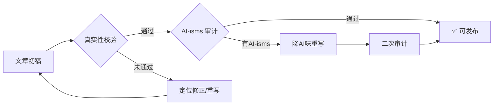

# 内容工厂工作流 (Content Factory)

## 概述

内容工厂是一个自动化周级内容运营流水线，每周按三阶段运行：

| 阶段 | 星期 | 命令 | 产出 |
|:----:|:----|:-----|:-----|
| 🔍 选题 | 周一 08:00 | `python3 weekly_cron.py monday` | 1篇深度+2篇短内容的选题方案 → Feishu |
| ✍️ 生成 | 周二 | `python3 weekly_cron.py tuesday` | 文章初稿（公众号/知乎/小红书）× 深度话题 |
| 🛡️ 审计 | 生成后立即 | 自动触发 | 真实性校验 + AI-isms 审计（avoid-ai-writing detect） |
| 🚀 发布 | 周四/周五 | `python3 weekly_cron.py thursday` | 发布提醒 & 状态汇总 |

## 代码结构

```
~/.hermes/scripts/content-factory/
├── weekly_cron.py           # 主编排入口（按参数调度阶段）
├── content_pool.py          # 话题池：从多个源提取候选话题
├── topic_calendar.py        # 主题日历：从候选池中选取周度主题
├── article_generator.py     # 文章生成器：为各平台生成文章
├── style_learner.py         # 风格学习器
├── review_manager.py        # 审核管理器
├── publisher_base.py        # 发布基类
├── publisher_wechat.py      # 微信公众号发布器
├── publisher_zhihu.py       # 知乎发布器
├── publisher_xiaohongshu.py # 小红书发布器
└── config.yaml              # 主配置文件
```

## 每日任务 → 话题发现机制（周五集中批处理）

> 你的日常就是最好的选题库。每次完成一个复杂任务，都可能是下一篇内容的种子。

### 行为规则：周中静默积累 → 周五集中汇总

**重要**：不每周中即时提示用户。发现好话题后，默默写入话题池，周五 cron 统一汇总呈现。

```
周一至周四：发现话题 → 静默入库（不打扰用户）
周五 09:00：cron 自动汇总本周新增话题 → 推送到内容市场部群
周末：用户思考挑选 → 下周一选题时自然被筛选
```

### 话题发现评估流程

每次完成**有信息量的任务**后（5+工具调用、非平凡结果），自动评估选题潜力：

```
① 这个任务有没有「反常识」或「可复现」的部分？
   有? → 可做选题，静默入库
   无? → 检查②

② 这个任务的数据/指标能不能「量化表达」？
   能? → 可做选题（有数据支撑的文章更容易传播）
   不能? → 检查③

③ 这个任务反映了什么普适问题？
   → 是「只有我们遇到的」还是「很多人都有的痛点」？
   → 很多人有 → 可做选题（共鸣型）

④ 选题属于哪种类型？
   ├─ 🔧 工程实践（架构决策、技术选型、踩坑复盘）
   ├─ ⚡ 效率工具（自动化管道、效率提升流程）
   ├─ 👁 行业观察（趋势分析、对比研究、方法思考）
   └─ 📚 教育实践（亲子教育、学习系统、知识管理）
```

### 好话题的判断标准

| 维度 | 好话题 | 放弃 |
|:----|:------|:----|
| **真实性** | 亲身经历，每段都能溯源 | 纯理论推演，无真实案例支撑 |
| **数据化** | 有数字（21.8K→3.6K，-83%）| 「大幅提升」「显著改善」 |
| **普适性** | 痛点很多人都有（记忆膨胀、质量保障）| 只有我们才有的特殊情况 |
| **方法论** | 能提炼出可复用的思考框架（三层存储、根因升级机制）| 一次性操作记录 |
| **结构感** | 有对比（之前vs之后/方案A vs 方案B）| 平铺直叙的流水账 |

### 如何静默入库

找到好话题后，直接写入话题池，**不询问用户**：

```python
# 用 execute_code 执行静默入库
from hermes_tools import terminal

cmd = '''
cd ~/.hermes/scripts/content-factory
python3 -c "
from content_pool import add_manual_topic
add_manual_topic(
    title="话题标题",
    summary="精炼摘要，含关键数据",
    topic_type="deep"
)
"
'''
terminal(cmd, timeout=30)
```

**重要**：入库后不要额外告诉用户「我存了一个话题」。周五 cron 会统一汇总。

### 与 Weekly Cron 的衔接

话题池中的每个条目带 `created_at` 时间戳：
- **周一**：`content_pool.get_candidates()` 按新鲜度+相关性评分，选出本周选题
- **周五**：cron 检查本周新增话题（created_at >= 本周一），整理为「本周话题发现」汇总

核心变化：**从「即兴发现→即时提示」变成「周中静默积累→周五统一呈现→周末思考→周一确认」**。

### 内容真实性原则（2026-05-11 用户明确要求）

**文章内容不能写成"我们的实践"，应该是"我们对一件事情的思考总结"。**

- 如果话题是我们**真实做过**的事（如 Hermes Agent 架构、教育系统搭建）→ 可以用"实战"口吻，但不虚构具体场景
- 如果话题是我们**没做过**的事（如企业流程自动化、保险行业实践）→ 必须用"观察""思考""分析"的口吻，不能冒充亲身经历
- 判断标准：文章中的每一段是否都能追溯到我们实际做过的事？如果有一段是"编的"，整篇定位就该改为分析/思考文章

**编写时的自查清单**：
```
□ 是否有任何段落是虚构的具体案例？（如"车险理赔Agent"→ ✗ 不可接受）
□ 是否有 "X个月我们做了Y" 但实际没做过的表述？
□ 是否明确区分了"我们观察到的" vs "我们做到的"？
□ 整篇文章定位是"实战分享"还是"思考分析"？前者只用于真实做过的事情
□ 是否有任何工具/服务推荐不是用户实际使用的？（如推荐"通义听悟/Kimi/飞书AI"但用户实际用Ollama+DeepSeek/飞书Task/Get笔记 → ✗ 不可接受）
```

### AI-isms 审计：生成后的自动审校环节（2026-05-12 新增）

每篇文章生成后（无论是自动生成还是手动生成），必须在发布前经过 **双重审计**：



#### 第一关：真实性校验（沿用现有自查清单）

即上方「内容真实性原则」中的自查清单。确保每段内容都能追溯到真实经历。

#### 第二关：AI-isms 审计（新增）

使用 `avoid-ai-writing` 技能对文章进行 **检测模式（detect）** 扫描：

在生成文章时自动加载 `avoid-ai-writing` 技能，执行以下流程：

```yaml
# AI-isms 审计清单
# 检测模式输出分组检查：
P0 — 可信度杀手（必须修复）：
  □ 有无 cutoff disclaimers（"As of my last update"）
  □ 有无聊天机器人语气（"I hope this helps!" "Great question!"）
  □ 有无空洞归属（"Experts believe" 无来源）

P1 — 明显AI味（建议修复）：
  □ 三级词汇表中的违规词（delve, leverage, harness, robust 等）
  □ 模板句式（"Whether you're X or Y"）
  □ "Let's"开头过渡句
  □ 同义替换综合征（连续3次换词说同一件事）
  □ 公式化开头（"In the rapidly evolving world of..."）

P2 — 风格润色（时间允许时修复）：
  □ 段落长度均匀
  □ 空泛结尾（"The future looks bright"）
  □ 动词过度替换（serves as, features, boasts → 直接用 is/has）
  □ "Moreover"/"Furthermore"/"Additionally" 过渡
```

**审计输出**：在文章的可发布状态通告中，附上审计结果摘要。

#### 第三关：二次审计（降AI味重写后的复检）

如果第二关发现问题并进行了重写，必须对重写版本再次运行 `avoid-ai-writing detect`，确认新模式也已通过审计。

---

**三种典型虚构模式（2026-05-12 实战发现的系统性漏洞）**：

| 虚构类型 | 示例 | 识别方法 | 如何修正 |
|:---------|:-----|:---------|:---------|
| **场景虚构** | "在保险行业尝试用AI Agent处理理赔"（用户没做过） | 问自己：这个案例有真实来源吗？ | 改为行业观察定位，去掉"我们"表述 |
| **工具虚构** | 推荐"通义听悟/Kimi/飞书AI"（用户实际用Ollama+DeepSeek/飞书Task/Get笔记） | 核对用户的真实工具链 | 逐个替换为用户实际使用的工具 |
| **身份虚构** | "作为一名AI架构师，我经历了…"（实际不是以这个身份经历的） | 检查叙述人称与用户真实角色的匹配度 | 改为"观察到…"/"思考…"中的洞察 |

### 话题多样性要求

周一选题时，话题池应覆盖多个方向供用户选择。当前已验证的分类：

| 分类 | 深度/短篇 | 举例 |
|:----|:---------:|:-----|
| 🔧 工程实践 | 深度为主 | 多Agent架构、本地模型成本、RAG工程 |
| ⚡ 效率工具 | 短篇为主 | 飞书待办、内容工厂、Get笔记 |
| 👁 行业观察 | 深度为主 | Agent生产化、技术选型决策 |
| 📚 教育实践 | 短篇为主 | 200天每日练习、语文手写识别 |

话题池至少保持8-10个有效话题，确保每周有2个以上的可选方向。

## 话题源管理

话题从以下数据源提取候选：

### 0️⃣ 日常对话话题（新增源）
每日15分钟主题对话（见 `daily-conversation-practice` skill）是高质量话题的天然来源。用户在对话中表达的真实经历、行业观察和概念碰撞，往往具备「有数据、有观点、有反常识」的好话题要素。

**接入方式**：对话锚定阶段识别到可扩展的洞察后，由 `daily-conversation-practice` 的流程自动调用 `content_pool.add_manual_topic()` 入库。无需额外操作。

**自动评估标准**：对话中用户表达的观点如果同时满足：
- 基于真实经历（有具体案例）
- 包含明确的判断/框架（不仅是感受）
- 具有普适性痛点（不仅是个人困境）
→ 即可判定为话题池候选，在对话结束时主动向用户推荐入库。

### 1️⃣ 手动话题文件
- **路径**: `~/.hermes/data/content-factory-topics.json`
- **格式**（含分类字段）:
  ```json
  {
    "topics": [
      {
        "title": "多Agent协作的架构演进",
        "summary": "基于真实系统的多Agent协作架构设计",
        "type": "deep",
        "category": "工程实践",
        "created_at": 1715380558
      },
      {
        "title": "用飞书API搭待办管理",
        "summary": "基于飞书Task v2 API的管理实践",
        "type": "short",
        "category": "效率工具",
        "created_at": 1715380559
      }
    ]
  }
  ```
- **增删改**: 调用 `content_pool.add_manual_topic(title, summary, topic_type, category)`

### 2️⃣ Get笔记缓存
- **路径**: `~/.hermes/cache/content-factory-getnotes.json`
- 由 Get笔记同步管道定期填充
- 格式: `{"notes": [{"title": "...", "content": "...", "type": "...", "created_at": ...}, ...]}`

### 3️⃣ 评分机制
- `freshness_weight`: 0.3（越新越高）
- `relevance_weight`: 0.4（含品牌关键词越多越高）
- `trend_weight`: 0.3（默认0.5）
- 品牌关键词: AI, 保险, 数据, 管理, 架构, 自动化, 系统, 大模型, agent, 智能, 数字化

## 数据流

```
话题源 (manual + getnotes)
     │
     ▼
content_pool.get_candidates()
     │  按评分排序，取top N
     ▼
topic_calendar.select_weekly_topics()
     │  分类为deep/short，选取1 deep + 2 short
     │  写入缓存: ~/.hermes/cache/content-factory-calendar.json
     │  生成Feishu Markdown
     ▼
weekly_cron.py monday
     │  读取缓存，调用 generate_feishu_message()
     │  输出 → Feishu 通知
     ▼
  [用户确认选题] → tuesday → 生成 → thursday → 发布
```

## Feishu 通知格式

`weekly_cron.py` 中的 `generate_feishu_message()` 函数为每个阶段生成Feishu友好的Markdown：

### 周一选题
```markdown
**C014 内容工厂 | 2026-05-11 Monday 选题建议**

**本周深度话题 (1/1):**
  {title}
  > {summary}

**推荐短内容 (2):**
  1. {title}
  2. {title}

请回复确认选题：
  /select deep=1, short=1,2  (选择深度话题1，短内容1和2)
  /skip 跳过本周
  /custom <你的选题>
```

## 已知Bug与修复

### Bug 1: 字段名 `topic_title` vs `title` （已修复 2026-05-11）

**症状**: Feishu通知中所有话题显示"待定"，即使 `content-factory-calendar.json` 中有正确数据。

**根因**: `weekly_cron.py` 中 `generate_feishu_message()` 函数使用 `deep.get('topic_title', '待定')` 和 `s.get('topic_title', '待定')` 读取话题标题，但 `topic_calendar.py` 写入的数据使用 `title` 字段（不是 `topic_title`）。

**修复**: 将 `topic_title` 替换为 `title`：
```python
# 修复前
msg += f"  {deep.get('topic_title', '待定')}\n"
# 修复后
msg += f"  {deep.get('title', '待定')}\n"
```

同时也修复了短内容计数字符串 `"推荐短内容 (2/{len(shorts)}):"` → `"推荐短内容 ({len(shorts)}):"`（写死了"2/"前缀）。

### Bug 2: 手动话题文件缺失（已修复 2026-05-11）

**症状**: 所有话题源返回空列表，Feishu显示"待定"。

**根因**: `content-factory-topics.json` 文件不存在，导致 `load_manual_topics()` 返回空列表。而 `calendar cache` 中仍有历史数据可用。

**修复**: 从 `content-factory-calendar.json` 缓存恢复话题到 `content-factory-topics.json`。

**陷阱**: 如果两个话题源都为空，`topic_calendar.select_weekly_topics()` 会返回错误 dict（含 `"error": "No candidates available from content pool"`），而 `generate_feishu_message()` 不处理此情况，仍按正常流程格式化，导致全部显示"待定"。

## 常见故障排查

### 🔴 症状: Feishu 显示 "待定"

**排查步骤**:
1. 检查 `content-factory-topics.json` 是否存在、非空
2. 检查 `content-factory-getnotes.json` 是否存在（可选源）
3. 检查 `content-factory-calendar.json` 是否包含有效数据
4. 如果缓存有数据但源文件缺失 → 从缓存恢复手动话题文件
5. 确认字段名：`weekly_cron.py` 中用 `title`，不是 `topic_title`

### 🔴 症状: 脚本正常输出但用户没收到飞书通知

**排查步骤**:
1. 检查 cron job 的 `deliver` 设置：`cronjob list` → 查看目标job的 `deliver` 字段
2. 如果 `deliver: local` → 输出只保存在本地，从不发送。修：`cronjob update --job-id <id> --deliver origin`
3. 创建新 cron job 时默认 `deliver: local`，与 Feishu 交互的 cron 必须手动改为 `origin`

**预防措施（构建 cron 时直接设置）**:
- 创建 cron job 时，如果该 cron 需要向飞书发送消息，记得在创建时或创建后立即设置 `deliver: origin`
- 周一选题 cron（8:02 AM）必须 `deliver=origin`，否则用户不会收到选题建议
- 用 `cronjob list` 确认所有需要外发的 cron 的 `deliver` 字段值

### 🔴 症状: 初稿包含虚构内容（非真实案例/数据）

**排查步骤**:
1. 检查文章是否包含我们没有亲身参与的场景描述（如保险理赔Agent、企业级流程自动化等）
2. 检查是否有「某某场景下我们做了…」但实际不存在的表述
3. 检查是否有虚构的具体数据（如"某保险公司实现了X%的降本"）

**修复策略（分三步）**:
1. **定位文章类型**：如果话题是真实做过的事 → 反查真实数据重写；如果话题不是真实做过的事 → 改为「行业观察与思考」定位，去掉所有"我们"开头的实战表述
2. **重写流程**：
   ```
   ┌─ 确认真实系统/数据存在？
   │   │ 是 → 提取真实架构图/数据/指标 → 用真实细节替换所有虚构内容
   │   │ 否 → 删除所有"我们做了X"的表述 → 改为"观察到X趋势"/"思考X方向"
   │   └─ 检查每段都能追溯到真实经历？不能再有编的段落
   ```
3. **验证**：打开文章全文，逐段问"这一段我能证明是我做的吗？" — 任何一段答不上来，就改文章定位
4. **飞书文档版本规则**：如果文章已经上传到飞书，不要在原文档上修改。保留原文档（V1不动），新建V2文档写真实版本，通过 `feishu-doc-versioning` skill 管理
5. **清理日历缓存**：文章重写后，`content-factory-calendar.json` 仍引用原话题名。更新 `feishu_markdown` 字段使其与重写后的实际标题一致，避免后续查询时出现"标题A（缓存）→ 标题B（实际）"的混淆。

### 🔴 症状: 缓存日历中的话题名与实际发布的文章标题不一致

**排查步骤**:
1. 检查 `~/.hermes/cache/content-factory-calendar.json` 中 `deep_topic.title` 和 `short_topics[*].title`
2. 与 `~/.hermes/data/generated-articles/current_week_articles.json` 中的实际文章标题对比
3. 如果因真实性重写导致标题变更 → 更新 calendar.json 的 `feishu_markdown` 字段
4. 不影响 cron 功能（只影响状态查询），但建议保持一致性

**修复方法**:
```python
import json
CAL = "~/.hermes/cache/content-factory-calendar.json"
with open(CAL) as f:
    cal = json.load(f)
cal["deep_topic"]["title"] = "新标题"
cal["short_topics"][0]["title"] = "新短标题1"
cal["short_topics"][1]["title"] = "新短标题2"
cal["feishu_markdown"] = cal["feishu_markdown"].replace("旧标题", "新标题")
with open(CAL, 'w') as f:
    json.dump(cal, f, ensure_ascii=False, indent=2)
```

### 🔴 症状: 生成的初稿显示"…"占位符或"（内容生成中…）"

**排查步骤**:
1. 检查 `article_generator.py` 的 `_call_llm()` 是否走入了 `_mock_llm_response()` 分支
2. 根因：`article_generator.py` 默认网关 `http://localhost:11434/api/chat`（Ollama），但发送 model 名 `deepseek-chat`，两端不匹配
3. 检查环境变量：`${HERMES_GATEWAY}` 和 `${DEEPSEEK_API_BASE}` 是否为空
4. 若 DeepSeek API 未配置，`article_generator` 会**静默降级**为 mock 占位符，且 cron 报告 **"ok"**（不报错！不会自动检测！）
5. 修复：设置正确的 API gateway 环境变量，或手动生成真实文章作为替代方案

**验证方法**（判断当前文章是真实内容还是占位符）：
```python
# 检查是否包含 mock 关键字
mock_markers = ["在实际项目中…", "内容生成中…", "（内容生成中…）", "## 核心观点", "1. 明确业务目标"]
with open(article_path) as f:
    content = f.read()
has_mock = any(m in content for m in mock_markers)
# 如果 has_mock → 走手动替换
```

### 🔴 症状: 脚本报错 ModuleNotFoundError

**排查步骤**:
1. `topic_calendar.py` 中已有 `sys.path.insert(0, _SCRIPT_DIR)` 处理同级模块导入
2. 如果从其他目录直接调用，确保 `PYTHONPATH` 包含脚本目录

### 🔴 症状: 周二/周四阶段找不到缓存

**排查步骤**:
1. 确认周一阶段成功运行（产生 `content-factory-calendar.json`）
2. 缓存路径: `~/.hermes/cache/content-factory-calendar.json`
3. 如果缓存丢失，直接运行 `python3 weekly_cron.py monday` 重新生成

## 飞书云盘存档

用户确认文章初稿后（/approve），应将文章上传到专用的飞书云盘文件夹，方便用户随时查阅、修改和发布。

### 文件夹结构

```
Hermes生成文件 (Otppfr9EelPIawdezL2csUXCnoh)
  └── 内容工厂出品 (OaHdfQM9flT1vudSxmFcHVRMnEg)  ← 每周文章存放处
        ├── 公众号_标题1
        ├── 知乎_标题2
        └── 小红书_标题3
```

- **文件夹 token**: `OaHdfQM9flT1vudSxmFcHVRMnEg`
- **别名**: `content-factory-output`（已注册到 feishu-tokens.json）
- **已共享给用户**（full_access）

### 存档流程（用户确认文章后执行）

```
用户确认选题 (/select 或 /approve)
  → Create Feishu doc in the folder
  → Write content via feishu-md-writer.py
  → 告知用户文件位置
```

**脚本模板**（Python）：

```python
import subprocess, json, tempfile
HOME = os.path.expanduser("~")
FOLDER_TOKEN = "OaHdfQM9flT1vudSxmFcHVRMnEg"
MD_WRITER = os.path.join(HOME, ".hermes", "scripts", "feishu-md-writer.py")

# Step 1: Create document
token = get_tenant_token()  # 用 FEISHU_APP_ID / FEISHU_APP_SECRET
doc_resp = api_call("POST", "/open-apis/docx/v1/documents", {
    "folder_token": FOLDER_TOKEN, "title": title
})
doc_token = doc_resp["data"]["document"]["document_id"]

# Step 2: Write content
md_content = f"# {title}\n\n{content}"
with tempfile.NamedTemporaryFile(mode='w', suffix='.md', delete=False) as f:
    f.write(md_content); tmp = f.name
subprocess.run(["python3", MD_WRITER, doc_token, tmp], timeout=120)
os.unlink(tmp)
```

**注意**: 
- `feishu-md-writer.py` 接受**位置参数**（doc_token, md_file），不是 `--doc-token` 标志
- 创建文档后，用户可自主编辑、分享或导出为 PDF/Word
- 文件自动存在于「Hermes生成文件 → 内容工厂出品」目录下，用户可从飞书云盘直接访问

## 配置参考

```yaml
# ~/.hermes/scripts/content-factory/config.yaml
publishing:
  deep_articles_per_week: 1
  short_posts_per_week: 2
  publish_day: friday

content_sources:
  getnotes:
    enabled: true
    cache: "~/.hermes/cache/content-factory-getnotes.json"
  manual:
    enabled: true
    topics_file: "~/.hermes/data/content-factory-topics.json"

content_pool:
  max_candidates: 10
  scoring:
    freshness_weight: 0.3
    relevance_weight: 0.4
    trend_weight: 0.3

article_generation:
  model: "deepseek"

notifications:
  platform: "feishu"
  chat_id: "oc_575e28286dba895bd619f911399b7d01"
```

## 陷阱与注意事项

1. **不要在周一之前删除手动话题文件** — `weekly_cron.py monday` 依赖此文件，缺失会导致空选题
2. **话题分类是启发式的** — `classify_topic()` 基于关键词+评分，可能不准确。中高评分长内容会被判定为 `deep`
3. **周二阶段依赖周一缓存的日历文件** — 如果周一失败，周二直接跳到生成会报错
4. **Feishu消息是纯文本Markdown格式** — 不是富文本卡片，飞书会渲染Markdown基本语法
5. **脚本在cron中运行时没有交互式确认环节** — 所有输出自动发送到Feishu，用户需手动回复确认（/select或/skip）
11. **工作流中的每个阶段都必须有对应的 cron 调度** — 文档中写了"周二生成"阶段（`python3 weekly_cron.py tuesday`），但从未创建对应的 cron 任务。周一→周二→周五的链式依赖中，周二环节缺失导致周五发布空跑。2026-05-14 新增 cron `54c117b76344`。验证方式：`cronjob list | grep C014` 应看到 3 个 cron：
    - `109e836fd119` — 周一 08:00 选题
    - `54c117b76344` — 周二 08:00 生成（2026-05-14 新增）
    - `5772dbd93675` — 周五 09:00 发布提醒（已加缺稿检测）
7. **缓存文件写入时间戳** — 如果周一在凌晨运行，缓存的 `generated_at` 和 `publish_date` 会使用运行时的datetime，不影响功能但注意时间
8. **Cron deliver 默认为 `local`** — Hermes 创建 cron job 时 `deliver` 默认是 `local`。如果 cron 需要向用户发送飞书通知（选题建议、文章初稿等），必须手动改 `deliver: origin`。排查时先用 `cronjob list` 检查。

9. **文章生成器静默降级为 Mock 占位符** — `article_generator.py` 的 `_call_llm()` 在 LLM 网关不可达时无提示地回退到 `_mock_llm_response()`，产出类似「在实际项目中…」「## 核心观点」「1. 明确业务目标」等占位符文本。cron 状态显示 "ok"，不报错。必须主动检查文章内容是否有 mock 标记来发现此问题。

10. **文章生成器网关配置不匹配** — `article_generator.py` 硬编码默认网关 `http://localhost:11434/api/chat`（Ollama）但发送 model `deepseek-chat`。DeepSeek API 环境变量 `${HERMES_GATEWAY}` 和 `${DEEPSEEK_API_BASE}` 均未设置时，所有文章都是 mock 占位符。修复：设置正确的 API base/key，或手动生成真实文章替代。
